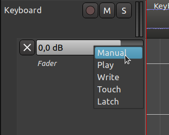

.. _automation_states:

Automation states
=================

In order to understand how automation in Ardour works, it is necessary
to understand the five states of automation. They are: **Manual**,
**Play**, **Write**, **Touch**, and **Latch**.

   The automation state menu

Manual state is basically analogous to a processor's bypass switch.
Whenever an automation lane is in this state, it is inactive and any
level that is manually set for controlling the lane's parameter will
persist during playback like normal.

.. note::
   In Ardour, every track and processor parameter is initially set to
   the **Manual** state.

The **Play** state tells Ardour to use the automation curve in the
automation lane to control the level of the parameter controlled by the
lane *during playback*. The control that normally sets the parameter
will be *unresponsive to manual input* and will move automatically in
accord with the lane's automation curve during playback.

The **Write** state allows continuous, dynamic setting of a control
during playback; all such settings are written to the lane the control
is in. This defines the lane's automation curve in the interval being
played, and overwrites any existing automation curve in the lane being
manipulated. As this might be sometimes dangerous, this state is
automatically changed to the **Touch** state when playing is stopped.

The **Touch** state is similar to Write state, except it only overwrites
sections of a lane's automation curve when the control is changed in
some way. This allows for changing only the parts of an automation curve
that are desired to be changed, while leaving the rest unchanged.

The **Latch** state is similar to the **Touch** state as it will also
change automation when the control is changed in some way during session
play back. But additionally it will overwrite the automation curve with
the last value that it was changed to until play-back is stopped.

The **Latch** state is also useful when the user wants Touch-style
behavior but is using a device incapable of sending messages to indicate
the start and end of the "touch".
