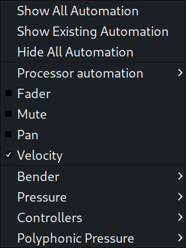
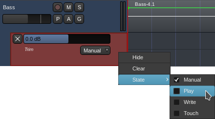

.. _track_automation:

Track automation
================

A parameter on a given track can be automated by clicking on the track's
**A** button and selecting a parameter to control from the menu that
appears. The same menu is displayed in the **Automation** submenu in
track's right-click menu.

Once a parameter has been selected, an automation lane for that
parameter will appear beneath the track. The lane thus shown will be
empty; from here an automation curve must be defined.

.. note::
   If the height of the automation lane is too small to see all of its
   controls, the height can be increased by left-clicking on the bottom
   border of the lane and dragging it down.

There are three ways to define an automation curve:

-  Recording it using **Write** mode
-  Recording it using **Touch** mode
-  Drawing it using the mouse

Recording an automation curve using write mode
~~~~~~~~~~~~~~~~~~~~~~~~~~~~~~~~~~~~~~~~~~~~~~

To create an automation curve using **Write** mode, first set the lane's
mode selector to **Write**, then set the playhead to the position where
the automation curve should start, then set the transport to play. While
the playhead is moving, Ardour will continuously record any changes made
with the lane's fader. Even if no changes are made to the fader, they
will overwrite anything that existed in the lane where the playhead is
moving. When the desired automation curve has been recorded, stop the
transport.

.. note::
   After the transport is stopped, the lane's mode selector will
   automatically switch to **Touch** mode—it is generally a bad idea to
   leave an automation lane in **Write** mode, as it is a destructive
   operation that makes it easy to inadvertently overwrite existing
   automation curves.

Recording an automation curve using touch mode
~~~~~~~~~~~~~~~~~~~~~~~~~~~~~~~~~~~~~~~~~~~~~~

Creating an automation curve using **Touch** mode is similar to the
method employed in creating one using **Write** mode; the only
difference is that changes are written to the automation curve *only*
when the lane's fader is moved—at all other times, whatever was in the
automation curve will remain as it was.

.. note::
   **Touch** mode is useful when only small parts of the automation
curve need touching up versus **Write** mode, which is usually used to
create the automation curve in the first place.

Drawing an automation curve using the mouse
~~~~~~~~~~~~~~~~~~~~~~~~~~~~~~~~~~~~~~~~~~~

In :ref:`Draw mode <toolbox>`, **control points** can be entered in the
automation lane in multiple ways.

-  By left-clicking in the lane at a point where there is no existing
   control point. Once added, a control point can be left-clicked and
   dragged to any desired location. Hovering over a control point will
   show its current value. **Warning:** creating a verbose automation
   with many control points can cause some plugins to overuse available
   system resources.
-  By left-clicking in the lane and drawing a free line from left to
   right.
-  By pressing :kbd:`Ctrl`, then pressing left in the lane and moving
   the mouse pointer from left to right or from right to left to
   preview a line segment, then releasing the mouse button to complete
   the action.

It's possible to combine free and straight lines in one go by pressing
:kbd:`Ctrl` for when you need a straight line and releasing the button
when you're done drawing a straight line segment.

.. video:: videos/automation-draw-free-and-straight-lines.mp4
   :width: 100%

Controlling the track
---------------------

Once an automation curve has been defined through any of the methods
outlined above, the track won't do anything with it until the lane that
the curve was defined in is set to **Play** mode. Then, during playback,
as the playhead moves through the automation curve, the lane's control
will move in accord with the curve.

.. note::
   The lane's fader will *not* be responsive to manual input while it
   is in **Play** mode.

Removing automation
-------------------

To remove a control point, left-click it and press :kbd:`Delete`, or
right-click on it.

   The automation lane context menu

Clearing the entire automation lane is done by right-clicking on the
lane to be cleared, and selecting **Clear** from the menu that appears.
