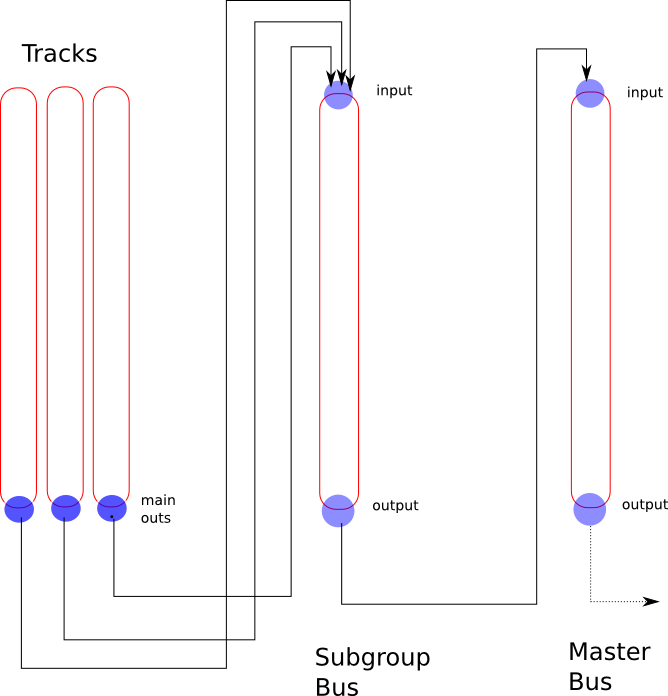

.. _aux_sends_vs_subgroups:

Aux sends vs subgroups
======================

Auxes and subgroups share a common concept—they both provide a way for
one or more tracks (or busses) to send their signal to a single bus so
that common signal processing can be applied to the mix of their
signals.

**Aux sends** leave the existing signal routing to the main mix in
place, and are typically used to create a separate mix to send to (for
example) monitors or headphones (for performer monitor mixes):

.. figure:: images/aux_routing.png
   :alt: Aux signal routing
   :figclass: invert-in-dark
   :width: 300px

   Aux signal routing

**Subgroups** usually remove the original signal routing to the main mix
and replace it with a new one that delivers the output of the subgroup
bus to the main mix instead.

   Sub group signal routing
