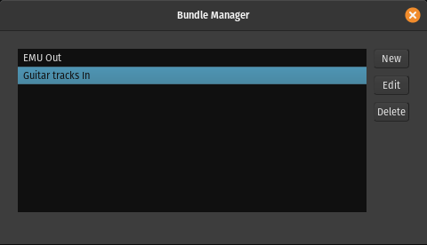
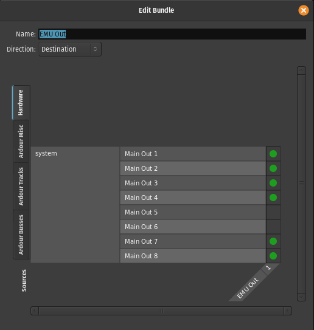
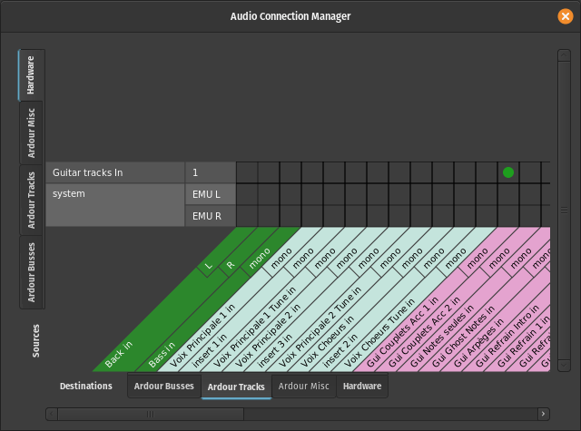

.. _bundle_manager:

Bundle manager
==============

The **Bundle Manager** simplifies connecting I/O channels in cases where
similarly purposed instruments/mics are scattered across a multi-channel
audio interface. A common scenario is recording a drumkit with 6 mics.
If you need to re-route the mics in the session, instead of connecting
each and every one of them separately, you can create a bundle and
connect just the bundle.

Bundles can be created for both sources (e.g. mic inputs) and
destinations (e.g. studio monitors). You can create as many bundles as
you like.

   Bundle Manager main window

Creating a bundle
-----------------

Click the **New** button to create a new bundle. In the newly opened
dialog, give it a name, choose whether you want this to be a bundle of
source or destination channels, then connect the ports that you want to
collect to the bundle port.

   Bundle Manager connection setup

Close the dialog to apply changes.

Connecting a bundle
-------------------

When connecting a bundle to a port, it works as a convenience proxy for
the physical ports. Clicking to connect a bundle (here, "Guitar tracks
in") to an input automatically connects all the actual ports in the
bundle at once.

   Bundle routing in the Audio Connection Manager

Editing and deleting bundles
----------------------------

At any time you can re-open the **Bundle Manager** window, select a bundle,
click **Edit** and change connection of physical ports to the bundle. Close
the window to apply changes.

You can easily delete an existing bundle. Open the **Bundle Manager**
window, select a bundle, click **Delete**.

Reusing bundles
---------------

As bundles are part of a session rather than a global setting, you can
save them as part of a template for further reuse. Simply create a new
session, create and connect tracks, busses, and bundles, then save your
session as a template. Choose this template when creating a new session.
