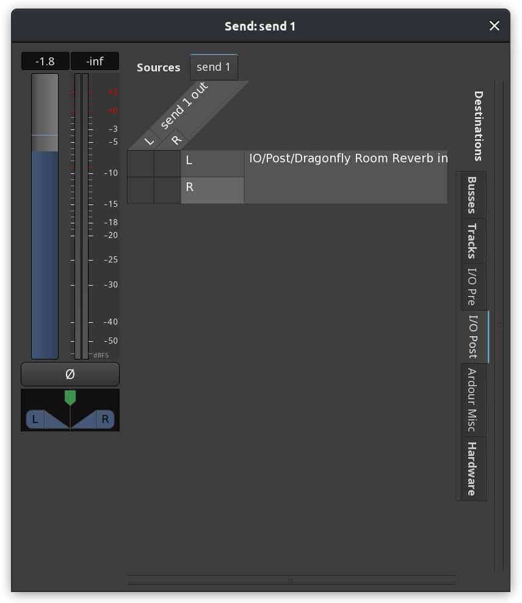

.. _external_sends:

External sends
==============

Like a normal aux send, an **external send** taps the signal at a specific
point within a channel strip, but delivers it to an external application
or piece of hardware rather than an Ardour bus. By itself, an external
send has no effect whatsoever on the audio signals within Ardour—it is a
one-way signal routing that leaves all existing signal processing just
as it was.

Most people will not have much use for this, but it can be useful to
experiment with external applications or hardware signal processing
applications.

Adding an external send
-----------------------

Context-clicking on the :ref:`processor box <processor_box>` in a
channel strip (at the desired location, pre or post fader) and choosing
**Add new External Send** will show a dialog containing the standard
Ardour :ref:`patchbay <patchbay>` to allow to connect the send to the
desired destination.

Removing an external send
-------------------------

An external send can be removed in several ways:

-  :kbd:`Shift`-right-clicking the send in the processor box and choosing
   either **Cut** or **Delete**.
-  Selecting the send (with a single left-click) and pressing the
   :kbd:`Del` key.

Altering send levels
--------------------

Just below the send in the processor box is a small fader that can be
used like all other faders in Ardour to control the gain applied to the
signal delivered by the send. Dragging it alters the level, 
:kbd:`Shift`-click restores to unity (``0dB``) gain.

Disabling sends
---------------

Clicking the small LED in the send display within the processor box
turns it on and off. When turned off, silence will be delivered to the
send. When turned on, the signal within the channel strip will be
delivered.

Editing send routing
--------------------

Double-clicking on the send in the processor box will re-display the
patchbay dialog that gives full control over the routing of the send, as
well as additional controls: gain fader, panner, signal meter, and phase
inverter.

   External Send Dialog
