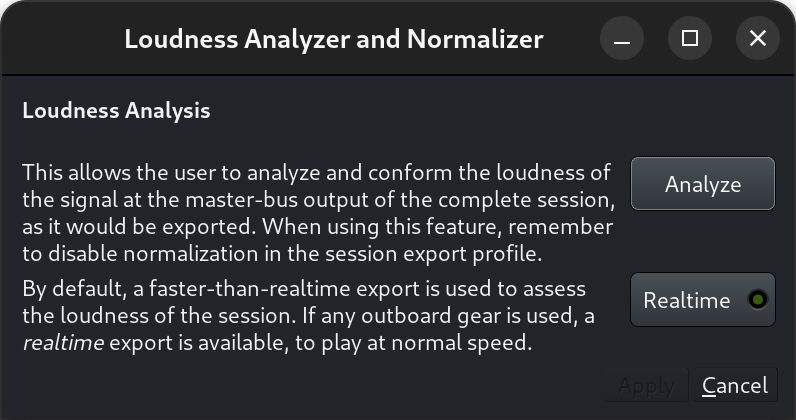
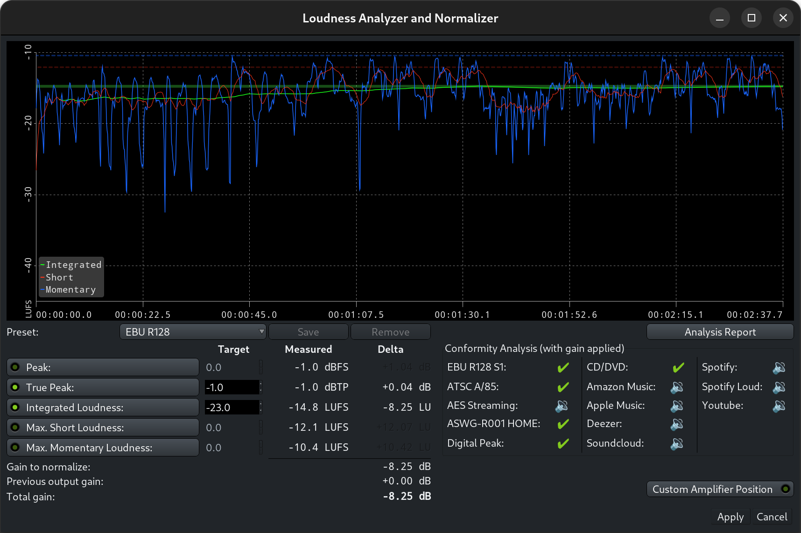
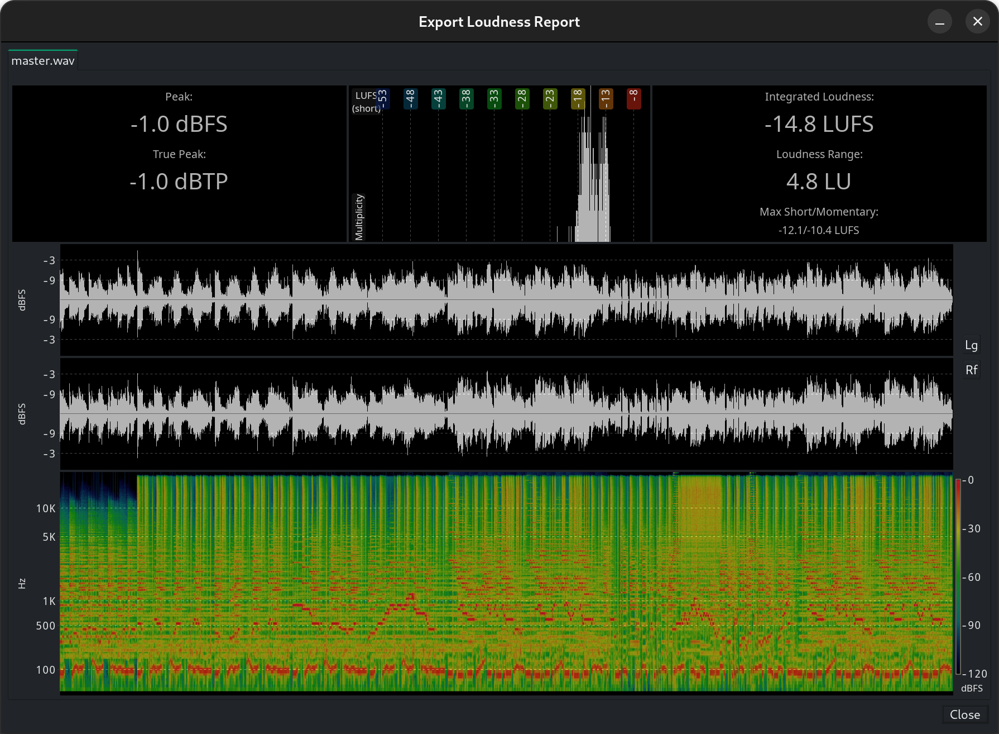

.. _loudness_analyzer:

Loudness Analyzer and Normalizer
=================================

The *Loudness Analyzer and Normalizer* tool is useful at the end of the
mixing process to make the final audio file comply with different specs
regarding loudness.

.. note::
   This is a rather advanced mode. When using the **Loudness Analyzer &
   Normalizer** (or LAN), one has to make sure than normalization is
   disabled when exporting. In general, it is recommended to just use
   :ref:`automatic export normalization <export_format_profiles>`, in
   the :ref:`Export dialog <export_dialog>`. This can also produce
   results for multiple targets at the same time.

It is enabled by checking Enable master-bus output gain control in the
:ref:`Preferences <preferences_signal_flow>`. The :ref:`Master Bus strip
<master_bus_strip>` then shows a LAN button to start the analysis, and a
volume slider that is the global gain that can be set either manually or
by the loudness normalizer.

The LAN can also be started from the **Session > Loudness assistant…**
menu. If the option above is not enabled, Ardour will link to the
relevant page of the **Preferences**.

Either method show the following window:

   The Loudness Analyzer realtime selector

This window allows to start the loudness analysis. A choice is offered
between freewheeling (i.e. Ardour renders the session as fast as
possible to measure the loudness), by default, or realtime, for cases
where freewheeling would not accurately render the session, e.g. if a
hardware or JACK effect is used in the session, by clicking on the
Realtime toggle button.

After the analysis is over, the Loudness Analyzer and Normalizer is
shown:

   The Loudness Analyzer and Normalizer

.. _loudness-graph:

The Loudness Graph
------------------

At the top of the window, a loudness graph visually represents the
analysis. The X axis represents the time, and the Y axis represents the
perceived loudness in LUFS:

-  Integrated loudness averaging the loudness on the whole session
-  Short loudness using a sliding time window of 3 seconds
-  Momentary loudness using a sliding time window of 400 ms.

Normalization Parameters
------------------------

As loudness is a perceived sonic energy, and depends on the level,
frequency, duration and nature of the sound, this window allows to base
the calculation of the loudness normalization on different parameters :

-  **Peak**: is the highest signal level value
-  **True Peak**: is the highest signal level value where the signal has
   been oversampled to figure out more in-between values between the
   samples (interpolation)
-  **Integrated Loudness**: is the loudness computed from the whole
   session or range
-  **Max Short Loudness**: is the maximum loudness computed on short time
   ranges (3 seconds)
-  **Max Momentary Loudness**: is the maximum momentary loudness

Any combination of these parameters can be taken into account when
determining the gain normalization, by checking its momentary button,
and setting a ***Target*** value.

Ardour shows both the ***Measured*** value of the parameters, and the
**Delta** value, i.e. the difference between the **Target*** and
**Measured*** values, hence the gain correction.

The maximum **Delta** value is the Gain correction to apply to fit all
the Target values.

Ardour shows, under the parameters, a summary of the calculation :

-  **Gain to normalize**: is the max **Delta** value
-  **Previous output gain**: is the current Master track gain
-  **Total gain**: is the difference between these two values, hence the
   correction to apply

Presets
-------

A selection of presets is offered to simplify the normalization. These
presets apply the relevant parameters and their target values. Below is
a table of these presets:

+-----------------+-------+-------+-------+-------+-------+----+------+-----+-----+-----+---------+--------+
| Parameter name: | dbFS  | dBTP  | LUFS  | short | mom.  | FS | TP   | int | sht | mom | maxIntg | notes  |
+=================+=======+=======+=======+=======+=======+====+======+=====+=====+=====+=========+========+
| EBU R128        | false | true  | true  | false | false | 0  | -1.0 | -23 | 0   | 0   | -22.5   | -23.5  |
+-----------------+-------+-------+-------+-------+-------+----+------+-----+-----+-----+---------+--------+
| EBU R128 S1     | false | true  | true  | true  | false | 0  | -1.0 | -23 | -18 | 0   | -22.5   | -23.5  |
+-----------------+-------+-------+-------+-------+-------+----+------+-----+-----+-----+---------+--------+
| ATSC A/85       | false | true  | true  | true  | false | 0  | -2.0 | -24 | 0   | 0   | -22.0   | -26.0  |
+-----------------+-------+-------+-------+-------+-------+----+------+-----+-----+-----+---------+--------+
| AES Streaming   | false | true  | true  | false | false | 0  | -1.0 | -18 | 0   | 0   | -16.0   | -20.0  |
+-----------------+-------+-------+-------+-------+-------+----+------+-----+-----+-----+---------+--------+
| ASWG-R001 HOME  | false | true  | true  | true  | false | 0  | -1.0 | -24 | 0   | 0   | -22.0   | -26.0  |
+-----------------+-------+-------+-------+-------+-------+----+------+-----+-----+-----+---------+--------+
| Digital Peak    | true  | false | false | false | false | 0  | 0.0  | 0   | 0   | 0   | 0.0     | -200.0 |
+-----------------+-------+-------+-------+-------+-------+----+------+-----+-----+-----+---------+--------+
| CD/DVD          | true  | true  | true  | false | false | 0  | -0.1 | -9  | 0   | 0   | 0.0     | -200.0 |
+-----------------+-------+-------+-------+-------+-------+----+------+-----+-----+-----+---------+--------+
| Amazon Music    | false | true  | true  | false | false | 0  | -2.0 | -14 | 0   | 0   | -9.0    | -19.0  |
+-----------------+-------+-------+-------+-------+-------+----+------+-----+-----+-----+---------+--------+
| Apple Music     | false | true  | true  | false | false | 0  | -1.0 | -16 | 0   | 0   | -15.0   | -17.0  |
+-----------------+-------+-------+-------+-------+-------+----+------+-----+-----+-----+---------+--------+
| Deezer          | false | true  | true  | false | false | 0  | -1.0 | -15 | 0   | 0   | -14.0   | -16.0  |
+-----------------+-------+-------+-------+-------+-------+----+------+-----+-----+-----+---------+--------+
| Soundcloud      | false | true  | true  | false | false | 0  | -1.0 | -10 | 0   | 0   | -8.0    | -13.0  |
+-----------------+-------+-------+-------+-------+-------+----+------+-----+-----+-----+---------+--------+
| Spotify         | false | true  | true  | false | false | 0  | -1.0 | -14 | 0   | 0   | -8.0    | -20.0  |
+-----------------+-------+-------+-------+-------+-------+----+------+-----+-----+-----+---------+--------+
| Spotify Loud    | false | true  | true  | false | false | 0  | -2.0 | -11 | 0   | 0   | -5.0    | -17.0  |
+-----------------+-------+-------+-------+-------+-------+----+------+-----+-----+-----+---------+--------+
| Youtube         | false | true  | true  | false | false | 0  | -1.0 | -14 | 0   | 0   | -13.0   | -15.0  |
+-----------------+-------+-------+-------+-------+-------+----+------+-----+-----+-----+---------+--------+

New presets can be created at will and saved/removed using the **Save**
and **Remove** buttons next to the preset choice. The Standard presets
listed above can not be removed or edited.

The Analysis Report button allows to visually represent the analysis
with a graph in a very similar window to the one in the
Post-:ref:`Export <export_dialog>` analysis.

   The loudness report

.. _conformity-analysis-panel:

The Conformity Analysis panel
-----------------------------

At the lower right end of the window is a **Conformity Analysis** info
panel indicating, for each of the presets above, if the corrected gain
would fit the required values:

-  ✖: the signal is too loud
-  ✔: the signal is too quiet, but satisfies the max. loudness spec
-  ✔: signal loudness is within the spec.

Lastly, the gain correction is, by default, applied after all the
processors of the master bus. This can also be changed, either by
checking the **Custom Amplifier Position** temporaty button in this window,
or in the Master strip, by right-clicking the gain slider and checking
**Custom LAN Amp Position**. The gain normalizer then becomes a processor in
the processors box of the Master strip, that can be moved as needed like
any processor/effect.
