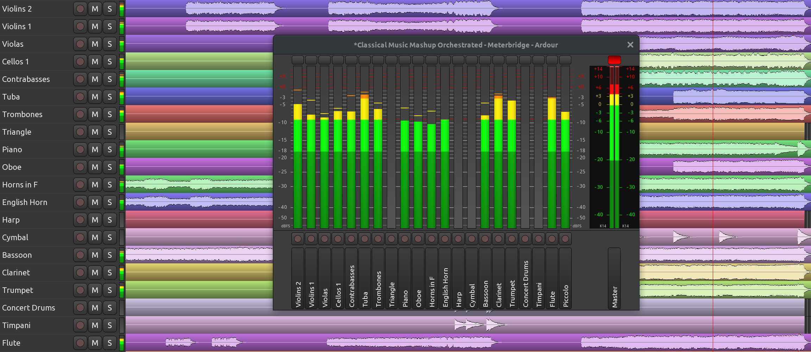

.. _meterbridge:

Meterbridge
===========

Meterbridge is a compact view of all meters in a session. It is designed
to assist for large recording sessions, particularly live recording
where the amount of mics is too large to get a good overview of the
entire session in either the Mixer or the Recorder window.

   Meterbridge window

By default, the **Meterbridge** window displays a meter per each track
with the track's name at the bottom and allows resetting the meter's
peak as well as arm a track for recording.

Each meter has a right-click menu to select the type of the meter. Just
like in the mixer channel view, tracks and regular audio busses default
to **Peak (+6 dBFS)** and the master bus defaults to **K14 (RMS)**. It's
also possible to set the same meter type to all same-type tracks.

Additionally, it's possible to select the height of the track name panel
by right-clicking above it and selecting one of the options going from
Short to Venti (which is a coffee cup size reference).

Just like in the usual mixer channel view, the **Arm for Recording**
button has a right-click menu to enable rec-safe mode to avoid
accidental recording to a track of choice.

The set of readily available controls can be customized per each session
on the **Meterbridge** page of the **Session Properties** dialog.

Additional controls include:

-  Mute button
-  Solo button
-  Monitor buttons
-  Fader as a gain knob

It's also possible to toggle visibility of MIDI tracks, busses, and the
master bus.
