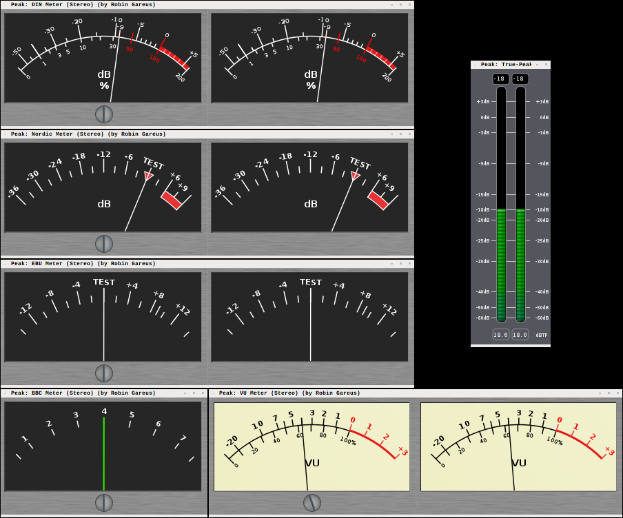

.. _metering:

Metering
========

Introduction
------------

An engineer reading and using audio level meters compares to a musician
reading or writing sheet-music. Just like there are virtuoso musicians
who can't read a single note, there are great sound-engineers who just
go by their ears and produce great mixes and masters without ever
looking at a single meter.

Yet, in order to work in or with the broadcast industry, it is usually
unavoidable to use meters.

Audio level meters are very powerful tools that are useful in every part
of the entire production chain:

-  When tracking, meters are used to ensure that the input signal does
   not **overload** and maintains reasonable **headroom**.
-  Meters offer a **quick visual indication** of an activity when working
   with a large number of tracks.
-  During mixing, meters provide an rough estimate of the **loudness** of
   each track.
-  At the mastering stage, meters are used to check compliance with
   upstream **level** and **loudness standards** and to optimize the
   **loudness range** for a given medium.

Meter Types
-----------

A general treatise on metering is beyond the scope of this manual. It is
a complex subject with a history… For background information and further
reading we recommend:

-  `How To Make Better Recordings in the 21st Century—An Integrated
   Approach to Metering, Monitoring, and Leveling Practices
   <http://www.digido.com/how-to-make-better-recordings-part-2.html>`__ by
   Bob Katz. Has a good historic overview of meters and motivates the
   K-meter
-  `Wikipedia: Peak programme
   meter <https://en.wikipedia.org/wiki/Peak_programme_meter#Table_of_characteristics>`__—overview
   of meter types.
-  "Audio Metering: Measurements, Standards and Practice: Measurements,
   Standards and Practice", by Eddy Brixen. ISBN: 0240814673
-  "Art of Digital Audio", by John Watkinson. ISBN: 0240515870

There are different metering standards, most of which are available in
Ardour. In short:

Digital peak-meter
   A **digital peak meter** displays the absolute maximum signal of the
   raw audio PCM signal (for a given time). It is commonly used when
   tracking to make sure the recorded audio never clips. To that end,
   DPMs are always calibrated to ``0 dBFS``, or the maximum level that
   can be represented digitally in a given system. This value has no
   musical reason whatsoever and depends only on the properties of the
   signal chain or target medium. There are conventions for
   **fall-off-time** and **peak-hold**, but no exact specifications.
   Various conventions for DPM fall-off times and dBFS line-up level can
   be chosen in **Edit > Preferences > Metering**.

RMS meters
   An **RMS-type meter** is an averaging meter that looks at the energy in
   the signal. It provides a general indication of loudness as
   perceived by humans. Ardour features three RMS meters, all of which
   offer additional peak indication.
   - **K20**: A meter according to the K-system introduced by Bob Katz,
   scale aligned to ``-20 dBFS``, rise/fall times and color schema
   according to spec.
   - **K14**: Same as K20 with scale aligned to ``-14 dBFS``.
   - **K12**: Same as K20 with scale aligned to ``-12 dBFS`` (since 3.5.143).
   - **Peak + RMS**: standard RMS, customizable via **Edit > Preferences > Metering**

IEC PPMs
   **IEC-type PPMs** are a mix between DPMs and RMS meters, created mainly
   for the purpose of interoperability. Many national and institutional
   varieties exist (EBU, BBC, DIN). These loudness and metering
   standards provide a common point of reference which is used by
   broadcasters in particular so that the interchange of material is
   uniform across their sphere of influence, regardless of the
   equipment used to play it back.

   For home recording, there is no real need for this level of
   interoperability, and these meters are only strictly required when
   working in or with the broadcast industry. However, IEC-type meters
   have certain characteristics (rise-time, ballistics) that make them
   useful outside the context of broadcast.
   Their specification is very exact, and consequently, there are no
   customizable parameters.

VU meters
   **VU meters** are the dinosaurs (1939) amongst the meters. They react
   very slowly, averaging out peaks. Their specification is very strict
   (``300ms`` rise-time, ``1–1.5%`` overshoot, flat frequency response).
   Ardour's VU meter adheres to that spec, but for visual consistency
   it is displayed as a bar-graph rather than needle-style (more below).

Ardour Specifics
----------------

.. figure:: images/mixer-meter-context-menu.png
   :alt: mixer strip meter context menu
   :class: right-float

Meters are available in various places in Ardour:

-  The mixer window features fixed height meters for each **channel strip**.
-  There are small (narrow) meters on each **track-header** in the editor
   window.
-  There are variable height meters in the **meterbridge window**.
-  Optionally, a fixed-size **master meter** can be displayed in the main
   toolbar.
-  Various other locations (**file import, sends**) have level-meters.

They all share the same configuration and color-theme which is available
in preferences and the theme-manager. Settings for the Peak and RMS+Peak
meters as well as VU meter standards are found in **Edit > Preferences >
Metering**.

The type of meter and the **metering point** (the place in the signal chain
where the meter taps the signal) are configurable in the context menu of
each meter. Depending on the **Edit > Preferences > Mixer** settings, the
metering point is also accessible via a button in each Mixer strip.

Regardless of meter type and standard the meter display will highlight
red if the signal on the given channel exceeds the configured peak
threshold.

- Left-clicking on the peak-indicator button resets the peak-hold indicator of a single channel,
- :kbd:`Ctrl`-left-clicking resets a whole group, and
- :kbd:`Ctrl-Shift`-left-clicking resets all meters.

Overview of meter types
-----------------------

The below figure shows all available meter-types in Ardour when fed with
a ``-18 dBFS`` ``1 kHz`` sine wave.

   Bar-graph meters in Ardour

Due to layout concerns and consistent look and feel all meters available
in Ardour itself are bar-graph type meters. Corresponding needle-style
meters—which take up more visual screen space—are available as LV2
plugins (see the below image): `meters.lv2
<https://github.com/x42/meters.lv2/>`__.

   Needle-style meters as external LV2 plugins