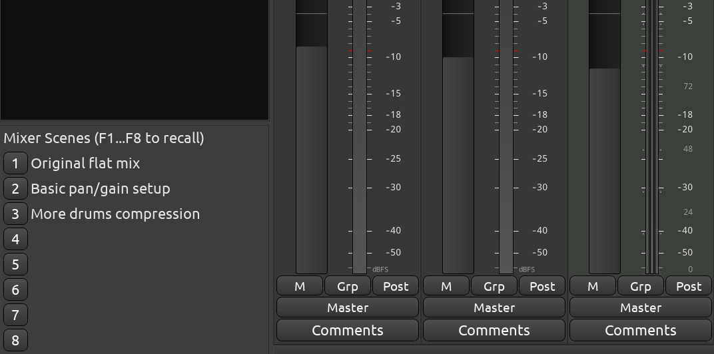
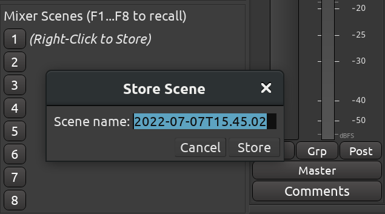
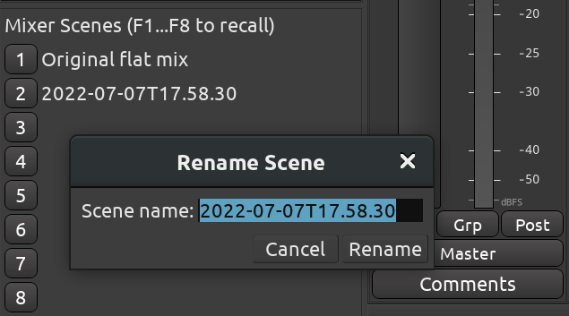

.. _mixer_scenes:

Mixer scenes
============

**Mixer scenes** are a convenient way to keep multiple variations of a
mix with the same set of tracks, busses, and plugins. In a recording
studio environment, you can use it to quickly navigate between versions
of a mix. In a broadcasting situation, it's a convenient way to quickly
"add" a new mic when another guest joins a conversation.

The user interface is located in the bottom left part of the Mixer
window. Scenes are numbered as 1 through 8 and have title to the right
of the numbers.

   Mixer Scenes in the Mixer window

You can store a new mixer scene, recall it, overwrite it, rename it, or
clear it. All interactions involve right-clicking, middle-clicking, or
left-clicking a button with a number that represents a scene.

What mixer scenes can and cannot do
-----------------------------------

As part of a mixer scene, you can store and recall only the controls
that you can automate:

-  Fader position in tracks, all types of busses, and VCA masters
-  Panner position in tracks and all types of busses
-  Foldback bus output levels
-  State of record arm
-  State of monitor input and monitor playback
-  State of solo and mute
-  Settings of plugins

Mixer scenes do not cover:

-  The general signal chain in the processor box, i.e. which plugins are
   loaded in whatever order
-  Plugin bypass states
-  Comments for mixer channels
-  Any monitor section controls (since v8.6-318-gb50477e608)

Storing a mixer scene
---------------------

All mixer scenes are enumerated in the user interface. Hover the mouse
pointer over an unused scene slot, right-click, then select **Store**.

When you create a new mixer scene, the name defaults to the timestamp of
the moment you are creating this scene. Instead, you can give scenes
meaningful names. That way you can reopen a session months later and be
able to tell which scene corresponds to which variation of the mix.

Recalling a mixer scene
-----------------------

To switch to an existing mixer scene (i.e. to recall it), simply
left-click on the button with the scene number.

It's possible to recall a mixer scene only for a selection of
tracks/busses. Select tracks or busses of interest by pressing
:kbd:`Shift` and then clicking inside respective processor boxes, then
right-click the mixer-scenes recall button for a context menu and choose
the **Restore for selected tracks** menu item.

.. note::
   When restoring a mixer scene, any control that is in automation Write
   or Touch mode will not be restored.

If you want to quickly compare the current scene against a different
one, hover the numbered button of the other scene, middle-click it and
hold. Release the mouse button when you're done comparing.

Renaming a mixer scene
----------------------

You can rename a scene at any time later. Right-click over the button
with scene's number, choose **Rename**, the enter a new name in the
newly opened dialog.

Clearing a mixer scene
----------------------

If you don't need a scene anymore or if you want to reserve it for
something else in the future, you can clear it. Right-click over the
button with scene's number, and choose **Clear**. This will empty the
scene slot.

If the scene you've just cleared was the one currently loaded, all
positions of faders, panners etc. will remain intact. You can continue
making further adjustments.

Overwriting a stored scene
--------------------------

If you made some adjustments and want them to be saved into an existing
scene, simply choose **Store** in the right-click menu for that scene.
Ardour will ask your confirmation for overwriting it and will suggest
renaming the scene (clicking the **Store** button without changing the
name will effectively keep the old name).

Accessing more mixer scenes
---------------------------

Ardour only exposes 8 mixer scenes in the user interface for
simplicity's sake. However the actual number of scenes is larger. There
are two ways to work around that and store, recall, and clear more mixer
scenes:

#. Keyboard shortcuts: Ardour already defaults to :kbd:`Ctrl-F1..F12` for
   storing mixer scenes and to :kbd:`F1..F12` for recalling them, which gives
   you 4 more scenes that are, however, not visible in the list. You can
   also manually assign any keyboard shortcuts (**Window > Keyboard
   Shortcuts**) to mixer scene actions.
#. Scripting: you can use :ref:`Lua scripts <lua_scripting>` to access
   the full range of available mixer scenes, which is 2\ :sup:`64`.