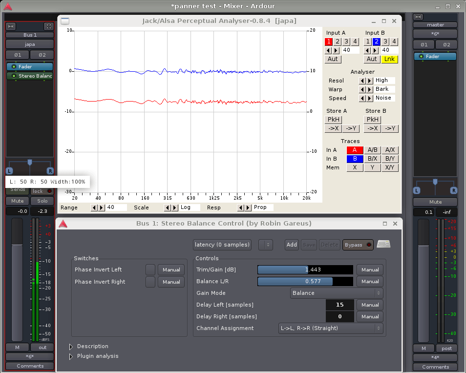

.. _stereo_panner:

Stereo panner
=============

The default **stereo panner** distributes two inputs to two outputs. Its
behaviour is controlled by two parameters, **width** and **position**. By
default, the panner is centered at full width.

The stereo panner assumes that the signals to distribute are either
uncorrelated (i.e. totally independent), or that they contain a stereo
image which is **mono-compatible**, such as a co-incident microphone
recording, or a sound stage that has been created with pan
pots (see below for `caveats <#stereo_panning_caveats>`__).

.. note::
   With the default values it is not possible to alter the position, since
   the width is already spread entirely across both outputs. To alter the
   position, the width must first be reduced.

Stereo Panner User Interface
----------------------------

.. figure:: images/stereo-panner.png
   :alt: The Stereo Panner
   :class: right-float

The **panner user interface** consists of three elements, divided
between the top and bottom half. Clicking and/or dragging in the top
half controls position; clicking and/or dragging in the bottom half
controls width (see below for details).

In the top half is the position indicator, which shows where the center
of the stereo image is relative to the left and right edges. When this
is the middle of the panner, the stereo image is centered between the
left and right outputs. When it all the way to the left, the stereo
image collapses to just the left speaker.

In the bottom half are two signal indicators, one marked **L** and the
other **R**. The distance between these two shows the width of the
stereo image. If the width is reduced to zero, there will only be a
single signal indicator marked **M** (for mono), whose color will change
to indicate this special state.

It is possible to invert the outputs (see below) so that whatever would
have gone to the right channel goes to the left and vice versa. When
this happens, the entire movable part of the panner changes color to
indicate clearly that this is the case.

Position vs. L/R
~~~~~~~~~~~~~~~~

Although the implementation of the panner uses the "position" parameter,
when the user interface displays it numerically, it shows a pair of
numbers that will be familiar to most audio engineers.

+----------+-------------+-------------------------------------------+
| Position | L/R         | English                                   |
+==========+=============+===========================================+
| 0        | L=50% R=50% | signal image is midway between left and   |
|          |             | right speakers                            |
+----------+-------------+-------------------------------------------+
| -1       | L=100% R=0% | signal image is entirely at the left      |
|          |             | speaker                                   |
+----------+-------------+-------------------------------------------+
| 1        | L=0% R=100% | signal image is entirely at the right     |
|          |             | speaker                                   |
+----------+-------------+-------------------------------------------+

One way to remember this sort of convention is that the middle of the
USA is not Kansas, but "Los Angeles: 50% New York: 50%".

Examples in use
~~~~~~~~~~~~~~~

========== ==================================
Appearance Settings
========== ==================================
|image1|   Width=100%, L=50 R=50
|image2|   Width=0%, L=50 R=50
|image3|   Width=-100%, Position = 0 (center)
|image4|   Width=36%, L=44 R=56
|image5|   Width=0%, L=0 R=100
========== ==================================

Using the mouse
^^^^^^^^^^^^^^^

Mouse operations in the upper half of the panner adjust the position
parameter, constrained by the current width setting.

Mouse operations in the lower half of the panner adjust the width
parameter, constrained by the current position setting.

The position can be changed smoothly, by pressing the right button and
dragging within the top half of the panner, then releasing. The position
will be limited by the current width setting. *Note: it is not necessary
to grab the position indicator in order to drag.*

The width can also be changed smoothly, by pressing the right button and
dragging within the lower half of the panner, then releasing. The width
will be limited by the current position setting. *Note: it is not
necessary to grab the L/R indicators in order to drag.*

+----------------------------------+------------------------------------+
| Reset to defaults                | Click :kbd:`Shift`-right           |
+----------------------------------+------------------------------------+
| Change to hard left              | Double-click :kbd:`Alt`-right in   |
|                                  | the upper left half of the panner  |
+----------------------------------+------------------------------------+
| Change to a hard right           | Double-click :kbd:`Alt`-right in   |
|                                  | the upper right half of the panner |
+----------------------------------+------------------------------------+
| Move position as far left as     | Double-click right in the upper    |
| possible, given width            | left half of the panner            |
+----------------------------------+------------------------------------+
| Move position as far right as    | Double-click right in the upper    |
| possible, given width            | right half of the panner           |
+----------------------------------+------------------------------------+
| Set the position to center       | Click right in the upper middle    |
|                                  | of the panner                      |
+----------------------------------+------------------------------------+
| Reset to maximum possible width  | Double-click right on the lower    |
|                                  | left side                          |
+----------------------------------+------------------------------------+
| Invert (flip channel             | Double-click right on the lower    |
| assignments)                     | right side                         |
+----------------------------------+------------------------------------+
| Set width to 0°                  | Double-click right in the lower    |
|                                  | middle                             |
+----------------------------------+------------------------------------+

Keyboard bindings
^^^^^^^^^^^^^^^^^

When the pointer is within a stereo panner user interface, the following
keybindings are available to operate on that panner:

:kbd:`↑` / :kbd:`Ctrl-↑` 
   increase width by 1° / 5°
:kbd:`↓` / :kbd:`Ctrl-↓` 
   decrease width by 1° / 5°
:kbd:`←` / :kbd:`Ctrl-←` 
   move position 1° / 5° to the left
:kbd:`→` / :kbd:`Ctrl-→` 
   move position 1° / 5° to the right
:kbd:`0`     
   reset position to center
:kbd:`Alt-↑`     
   reset width to full (100%)

Using the scroll wheel/touch scroll
^^^^^^^^^^^^^^^^^^^^^^^^^^^^^^^^^^^

When the pointer is within a stereo panner user interface, the scroll
wheel may be used as follows:

:kbd:`⇐ / :kbd:`Ctrl-⇐` 
   increase width by 1° / 5°
:kbd:`⇒ / :kbd:`Ctrl-⇒` 
   decrease width by 1° / 5°
:kbd:`⇑ / :kbd:`Ctrl-⇑` 
   move position 1° / 5° to the left
:kbd:`⇓ / :kbd:`Ctrl-⇓` 
   move position 1° / 5°to the right

.. _stereo_panning_caveats:

Stereo panning caveats
----------------------

.. important::
   The stereo panner will introduce unwanted side effects on material
   that includes a time difference between the channels, such as A/B,
   ORTF or NOS microphone recordings, or delay-panned mixes.

   When the width is reduced, two highly correlated signals with a delay
   are effectively summed, which will cause comb filtering.

Let's take a closer look at what happens when a source is recorded at
45° to the right side with an `ORTF stereo microphone array
<https://en.wikipedia.org/wiki/ORTF_stereo_technique>`__ and then the
width manipulated.

For testing, we apply a **pink noise** signal to both inputs of an
Ardour stereo bus with the stereo panner, and feed the bus output to a
two-channel analyser. Since pink noise contains equal energy per octave,
the expected readout is a straight line, which would indicate that our
signal chain does not color the sound:

   Stereo panner with ORTF full width

An ORTF is simulated using Robin Gareus' stereo balance control LV2 to
set the level difference and time delay. The Trim/Gain can be
ignored—its purpose is just to align the test signal with the 0dB line
of the analyser.

An **ORTF** microphone pair consists of two cardioids spaced 17 cm apart,
with an opening angle of 110°. For a far source at 45° to the right, the
time difference between the capsules is 350 μs or approximately 15
samples at 44.1 kHz. The level difference due to the directivity of the
microphones is about 7.5 dB (indicated by the distance between the blue
and red lines in the analyser).

Now for the interesting part: if the width of the signal is reduced to
50%, the time-delayed signals will be combined in the panner. What
happens to the frequency response of the left and right outputs is shown
in the following picture:

   Stereo panner with ORTF half width

It can be argued that all spaced microphone recordings will undergo comb
filtering later, when the two channels recombine in the air between the
speakers. Perceptually however, there is a huge difference: our hearing
system is very good at eliminating comb filters in the real world, where
their component signals are spatially separated. But once they are
combined inside a signal chain, this spatial separation is lost and the
brain will no longer be able to sort out the timbral mess.

.. note::
   Depending on the material and on how much the width needs to be
   manipulated, some degree of comb filtering may be acceptable. Then
   again, it may not. It is advised to listen carefully for artefacts
   when manipulating unknown stereo signals—many orchestra sample
   libraries for example do contain time-delay components.

.. |image1| image:: images/stereo-panner.png
.. |image2| image:: images/stereo-panner-zero.png
.. |image3| image:: images/stereo-panner-inverted.png

