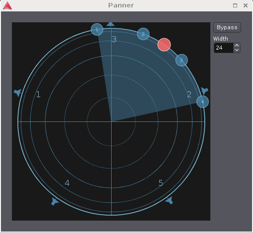

.. _vbap_panner:

VBAP panner
===========

.. important::
   Ardour's VBAP panner is currently in development, and its semantics
   may change in the near future, possibly affecting mixes using it. It
   is advised not to rely on it for important production work while the
   dust settles.
   
   The Panner only works in fixed static mode, it does not support
   automation playback.

VBAP is a versatile and straightforward method to pan a source around
over an arbitrary number of speakers on a horizontal polygon or a 3D
surface, even if the speaker layout is highly irregular.

Basic concepts
--------------

VBAP was developed by Ville Pulkki at Aalto University, Helsinki, in
1997. It works by distributing the signal to the speakers nearest to the
desired direction with appropriate weightings, aiming to create a
maximally sharp phantom source by using as few speakers as possible:

-  one speaker, if the desired direction coincides with a speaker
   location,
-  two speakers, if the desired direction is on the line between two
   speakers,
-  and three speakers in the general 3D case.

Thus, if the panner is moved onto a speaker, only this speaker will get
any signal. This is handy when precise 1:1 routing is needed.

The drawback of VBAP is that a moving source will constantly change its
apparent sharpness, as it transitions between the three states mentioned
above.

An **horizontal** VBAP panner has one parameter, the **azimuth angle**.
A **full-sphere** panner offers an additional **elevation angle**
control.

.. note::
   More elaborate implementations of VBAP also include a **spread**
   parameter, which will distribute the signal over a greater number of
   speakers in order to maintain constant (but no longer maximal)
   sharpness, regardless of position. Ardour's VBAP panner does not
   currently include this feature.

Speaker layout
--------------

Each VBAP panner is specific to its **speaker layout**—the panner has to
"know" about the precise location of all the speakers. A complete VBAP
implementation must therefore include the possibility to define this
layout.

.. figure:: images/VBAP-panner-5.png
   :alt: The VBAP panner with 5 outputs
   :figclass: mini

   The VBAP panner with 5 outputs

Ardour currently uses a simplified approach: if a track or bus has more
than two output channels (which implies stereo), it assumes that there
are N speakers distributed in a regular N-gon. That means that for
irregular layouts such as 5.1 or 7.1, the direction dialed in will
differ a bit from the actual auditory result, but any desired
spatialisation can still be achieved.

Experimental 3D VBAP
~~~~~~~~~~~~~~~~~~~~

For tracks with 10 outputs, Ardour will currently assume a 3-dimensional
speaker layout corresponding to Auro-3D 10.1, which is a horizontal 5.1
system, four elevated speakers above L, R, Ls, and Rs, and an additional
"voice-of-god" speaker at the zenith.

   The VBAP panner with 10 outputs, in experimental 3D mode

N:M panning
-----------

For tracks and busses with more than one input, Ardour will (for now)
assume that the inputs are distributed symmetrically along the latitude
around the panner direction. The width parameter controls the opening
angle of the distribution sector.

   The VBAP panner in 4 in, 5 out mode