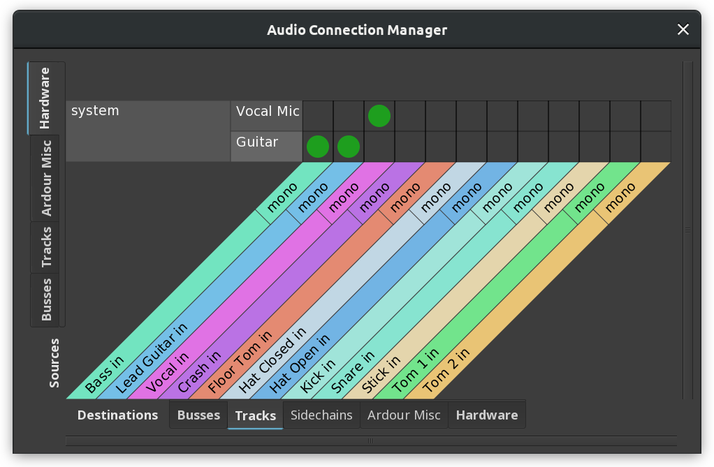

.. _patchbay:

Patchbay
========

The patchbay is the main way to make connections to, from and within
Ardour's mixer.

.. note::
   Notable exceptions are internal aux sends and connections to the
   monitor bus (when using one): these cannot be controlled from a
   patchbay, and are basically not under manual control at all.

The patchbay presents two groups of ports; one set of **sources** (which
produce data), and one of **destinations** (which consume data).

   An example patchbay

Depending on the relative number of each, the sources will be placed on
the left or the top of the dialogue, and the destinations on the right
or the bottom. Thus, in general, signal flow is from top or left to
right or bottom.

Both sources and destinations are divided up into groups, with each
group being given a tab:

Hardware
   These are ports which are connected to a physical piece of hardware
   (a sound card or MIDI interface).

Ardour Misc
   These are other ports that do not fit into the previous two
   categories; for example, the ports on which the metronome click is
   output, and MIDI ports for things like control surfaces and timecode.

I/O Pre
   All ports of I/O Pre-Process Plugins.

I/O Post
   All ports of I/O Post-Process Plugins.

Tracks
   All ports belonging to tracks.

Busses
   All ports belonging to busses.

Other
   If the Jack backend is being used and if there are other JACK clients
   running, their ports will be found here. If there are no such ports,
   the tab will not exist (on one or both axes of the grid).

The main part of the patchbay is a **matrix grid**. Within this grid, green
dots represent connections, and any of the squares can be clicked on to
make or break connections. Clicking and dragging draws a line of
connections, which is sometimes useful for making many connections at
once.

In the example patchbay shown above we can note various things. We are
using the **Ardour Tracks** sources tab, so we see the output ports of the
three tracks in our session: Fred, Jim and Foo. Our destinations are
from the **Ardour Busses** tab, so we have the inputs of a session bus,
Sheila, and the inputs of the master bus. Fred and Jim have stereo
outputs, so have L and R connections. Foo is a MIDI track, so it only
has one connection, and its squares in the grid are coloured light grey
to indicate that no connection can be made between Foo (a MIDI output)
and our busses (which are all audio-input).

The green dots in the example show that both Fred and Jim are connected
to the master bus, left to left and right to right.

Variants on the Patchbay
------------------------

Slightly different versions of the patchbay are available from different
places in Ardour. A global view of all audio connections is available,
in **Window > Audio Connections**, or by pressing :kbd:`Alt-P`. A
corresponding **MIDI Connection Manager** can be opened using
:kbd:`Alt-Shift-P`.

There is also a patchbay available when connecting individual tracks;
clicking on the input or output buttons of a mixer strip will open a
connection manager which has the corresponding track input or output as
the only destination or source, with all other ports available for
connection to it.

Other patchbay features
-----------------------

Right-clicking on a port name in the connection manager opens a context
menu which provides a few handy options:

Add audio port / Add MIDI port
   These options add audio or MIDI ports to the clicked source, if this
   is possible. In this way, for example, tracks and busses can be
   extended to have more inputs or outputs.

Remove *port_name*
   Removes the given port, if possible. :kbd:`Shift`-right-clicking
   a port will do the same.

Disconnect all from *port_name*
   Disconnects everything from the given port.

Rescan
   If Ardour is using the JACK backend, Ardour will try to keep abreast
   of any changes to the JACK ports on the system, and reflect them in
   any connection managers which are open. If for some reason this
   fails, this can be used to re-scan the list of ports and update the
   manager.

Show individual ports
   If a session has lots of multi-channel tracks or busses, it may be
   an unnecessary detail that left has to be connected to left and
   right to right every time a connection is made. This obviously gets
   worse with higher channel counts (such as for 5.1 or Ambisonics).
   To make life easier with such sessions, Show individual ports can be
   unticked. After that, the channels of tracks and busses will be
   hidden, and any green dots added in the connection manager will
   automatically connect each channel of the source to the corresponding
   channel of the destination (left to left, right to right and so on).
   In this mode, a half-circle in the connection grid indicates that
   some (but not all) of the source's ports are connected to the
   destination.

Flip
   This will flip the visible ports on the vertical axis with those on
   the horizontal. If, for example, the top of the connection manager is
   showing **Ardour Busses** and the right is showing **Hardware**, flip
   will swap the view to the opposite. Flipping can also be done by
   pressing :kbd:`f`. Note that if there are no matching tabs on both
   axes, flipping will be impossible.
