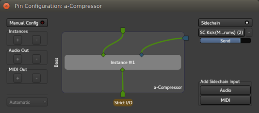
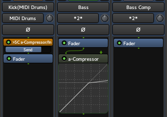
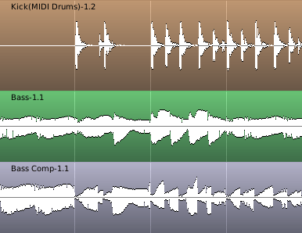

.. _sidechaining:

Sidechaining
============

Dynamic processors—such as compressors—in general use the the original
input signal for analysis and operate on the same signal. Side-chaining
uses the signal level of *another input* to control the compression
level of the original signal.

Effect processors which have a side-chain input (sometimes also called
*key input*) have an additional input pin to receive a signal from an
external input. In Ardour that extra input can be connected in the
plugin's **Pin Configuration** dialog: the signal from one track can be
tapped off and used as an input to a plugin on a different track. This
dialog is accessed via the plugin's **context-menu > Pin Connections…**.

In case a plugin has a dedicated sidechain input, Ardour automatically
creates a port for the input. This is a normal I/O port which can be fed
by any external signal. The **Pin Configuration** dialog is not limited
to processors with a dedicated sidechain input, it also allows to
manually create (or remove) a sidechain input port and provides for
flexible connection of the signal to plugin pins.

The operational flow in the Ardour's user interface starts at the
processor which is to receive the signal: a sidechain source is
selected, and Ardour creates a dedicated send-processor in the source
processor box, the level of which can be adjusted either in the Pin
Configuration window or directly on the source's send.

A simple example: Sidechain compression
---------------------------------------

One example is the use of a bass drum track to trigger the compression
on a bass track. The sidechain compressor (**a-Compressor**) will be
placed on the bass track, and will need to receive the signal from the
bass drum track as a way to trigger the compression.

.. container:: float

   |Sidechain compression: Pin configuration| |Sidechain compression:
   Mixer view| |Sidechain compression: Editor view|

Here, on the bass track, an *a-Compressor* has been added, and the Drum
track has been set as the sidechain source. The mixer reflects this by
showing an *SC*-send processor in the drum track, very similar to a
:ref:`send <aux_sends>`. The bass track also shows an arrow as one of the
a-compressor input.

As a result, in the editor, each peak in the kick drum track triggers
the compression on the bass track and the resulting track shows the
compression kicking in on each kick drum peak, hence reducing the gain.
The compression is applied to the bass, but only based on the level of
the drum track.

This is commonly used for *ducking* effect, when e.g. a radio speaker's
voice triggers the compression on the audio playing.

MIDI Sidechaining
-----------------

Ardour allows the sidechain sources to be either audio or MIDI
tracks/busses. This is particularly useful when a MIDI signal is used to
control an audio effect, like a vocoder or an auto-tuner, like `fat1
<https://github.com/x42/fat1.lv2>`__, the LV2 port of Fons Adriaensen's
`Zita AT1
<http://kokkinizita.linuxaudio.org/linuxaudio/zita-at1-doc/quickguide.html>`__
by Robin Gareus:

.. figure:: images/pin-connection-autotune.png
   :alt: MIDI Sidechain

   MIDI sidechaining example: fat1.lv2.

Here, the MIDI track is inputted to the plugin's MIDI IN pin through a
sidechain, indicating to the plugin what note the source audio should be
corrected to.

.. note::
   Notice that in the example above, the output of the "Vocals" track is
   connected to the input of the "Corrected" track. We could have chosen
   to insert the "Vocals" track content as an audio sidechain too,
   totally disconnecting the input from the plugin, and connecting the
   plugin's input pin to the audio sidechain port.

Pre-processing the sidechained signal
-------------------------------------

Sometimes, the effects of a sidechain signal on a plugin can be enhanced
by pre-processing the signal.

In the first example above, if the entire drum part is on one track,
then compressing with this signal as a sidechain will result in every
peak triggering the compression, be they bass drum kicks or snare,
cymbals, etc.

In this case, adding an EQ to the drum track with a low pass filter
would filter out the peaks created by the high pitched instruments of
the drum kit, and allow for a better triggering, though to avoid
damaging the original drum track, a send to an intermediary track would
be better suited to place the EQ on. This track won't be connected to
the Master, as its content is of no musical interest except for its use
as a trigger, allowing for some extreme EQ.

