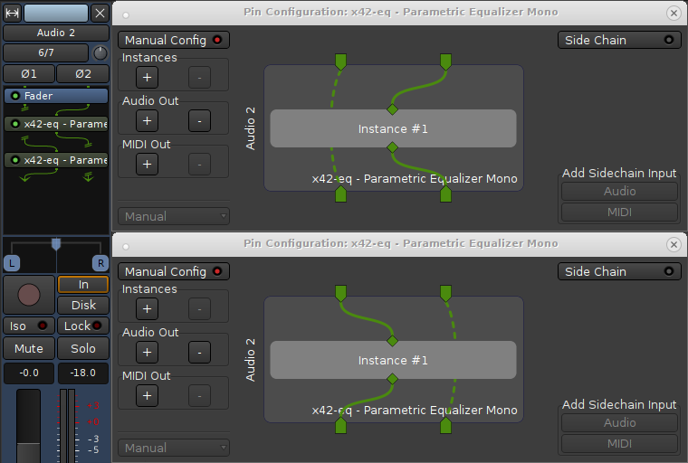

.. _track_bus_signal_flow:

Track/bus signal flow
=====================

Overview
--------

.. figure:: images/track_signal_routing.png
   :alt: track signal routing
   :class: right-float

In each individual track or bus the signal flow is top to bottom, as
shown in the diagram on the right.

Trim, fader, and panner are provided by Ardour. the processor box can
hold third party plugins or host-provided redirects (insert, aux-send,
etc.).

An important aspect is that the signal flow is multi-channel and not
fixed throughout the track. For example, a track can have a mono input,
a mono to stereo plugin (e.g. reverb) flowing into a surround panner
with 6 outputs.

The design of Ardour is that the width of the signal flow is defined by
the passage through plugins in the processor box, followed by panning.
The number of inputs to the panner is defined by the number of outputs
of the last plugin in the chain. The number of panner outputs is equal
to the track's outputs ports, which can be added and removed
dynamically. This schema is called *Flexible I/O*. It is very powerful
and a distinctive feature of Ardour.

.. note::
   The golden rule of processor signal flow: The number of outputs of one
   link of the process chain defines the number of inputs of the next,
   until the panner.

Due to this rule there is one very common case that is hard to achieve:
keeping a mono track mono. With *Flexible I/O*, if a stereo plugin is
added on a mono track, the signal flow after that plugin becomes stereo.

Strict I/O
----------

Strict I/O enforces a simple rule: plugins have the same number of
inputs as they have outputs. By induction the track will have as many
output ports as there are input ports.

Adding a plugin will not modify the signal flow. The number of plugin
outputs is forced to the number of inputs present at the point of
insertion. If a plugin pin is missing, it is ignored. If a plugin pin is
not connected, it is fed with silence. Non-connected plugin outputs are
ignored.

Strict I/O enforces the number of output ports. The number of inputs to
the panner (outputs of last plugin) defines the number of track outputs
(after panner). Required ports are automatically added, excess ports are
removed. The user cannot manually add or remove output ports.

Strict I/O is set when creating the track and can later be enabled or
disabled dynamically in the context menu of every mixer strip.

   Flexible vs. Strict I/O.

There are two exceptions to the above rule:

-  MIDI Synths. When adding a synth at a point where there is a Midi
   port only, the synthesizer plugin will add audio output ports, which
   trickle down the processor chain to all follow up plugins as inputs
   and in turn force their outputs to match
-  Side chain inputs are not affected by Strict I/O

Customizing the signal flow: the Pin Connection window
------------------------------------------------------

The signal flow though the mixer can be customized at every processor
node via **Pin Configuration** in the context menu of every processor.
User customization overrides all automatic (**Flexible** and **Strict
I/O** mode) inferred output port settings.

The Pin Connection window is made of three vertical sections:

-  an I/O config column
-  an interactive diagram
-  a sidechain column

By default, the **I/O config** is set to **Automatic**, i.e. the
**Manual Config** LED light is turned off. In this mode, the diagram
will display the standard input/outputs for this plugin, i.e. the number
of ports (inputs & outputs) is equal to the number of pins on the
plugin, and a one-to-one connection is automatically created.

Adding new instances of the plugin allows to apply this plugin to more
inputs or outputs. E.g., a mono effect can be applied to each channel of
a *n*-channels track by adding as many instances of the plugins as there
are input channels (i.e. ports). This happens automatically when adding,
e.g., a mono effect to a stereo track:

-  Ardour creates two instances of the plugin
-  the plugin gets a (2x1) label in the processor box
-  its two input ports are each connected to one pin of an instance
-  each mono output pin of the plugin is connected to one output port

Output channels can also, in **Manual Config** mode, be added or
removed, whether they are audio or MIDI.

.. note::
   Using the **in Connection** overrides the **I/O config** setting
   (**Flexible** vs. **Strict**). A processor *can*, even in Strict I/O
   mode, have a different number of outputs than inputs. Non-customized
   plugins downstream will follow suit depending on the selected route
   mode. e.g. adding an additional output to a plugin on a track set to
   **Strict I/O** will trickle down the process chain to the output and
   result in the addition of an output port. This is useful for example
   in case of a mono to stereo reverb.

The window allows connection of the I/O ports to the plugin pins and
other I/O ports, provided they are compatible (MIDI vs. audio), just by
dragging and dropping the end connectors on top of one another. A dotted
connector's line is a "*thru*" line that directly connects an input to
an output without connecting to a pin on the plugin—hence without any
audio modification. These "thru" connections are latency compensated,
with respect to those being affected by the plugin, in order to avoid
phasing issues.

An example of using "thru" connections, shown below, is separate
left/right channel equalization using two mono plugins on a stereo
track:

   An example of using two mono plugins on a stereo track.

The only way to add inputs to a processor is via
:ref:`Sidechaining <sidechaining>` from another signal. This is done by
"tapping" the signal from another track or bus at any point.

Adding a sidechain signal in Ardour is as simple as enabling the **Side
Chain** button in the **Pin Configuration** window, and choosing an
**Audio** or **MIDI** sidechain in the **Add Sidechain Input** lower
right hand section. A new drop-down menu appears, which displays a list
of the tracks/busses available to be sidechained, or, for a more complex
setup (e.g. sidechaining from hardware directly), the :ref:`Routing Grid
<patchbay>` (also accessible with a right-click on the drop-down menu).

The sidechain ports can then be connected, as other inputs, to a pin of
the plugin, or an output port as a "thru".
