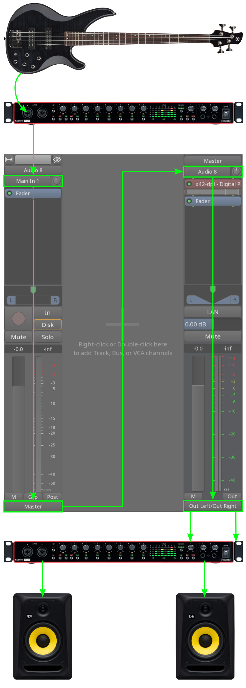
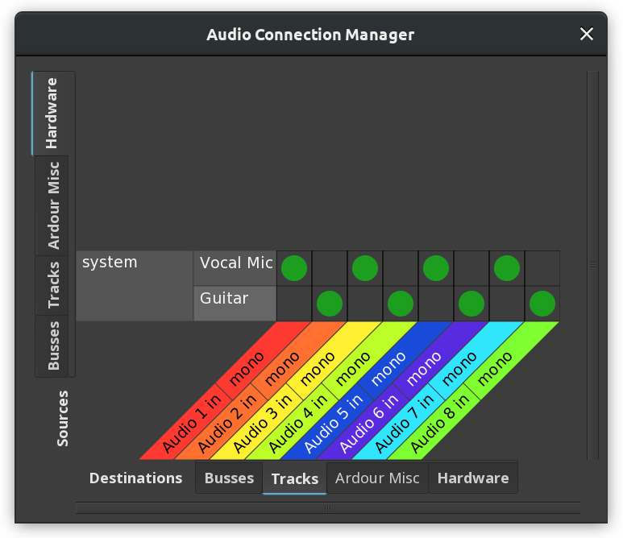
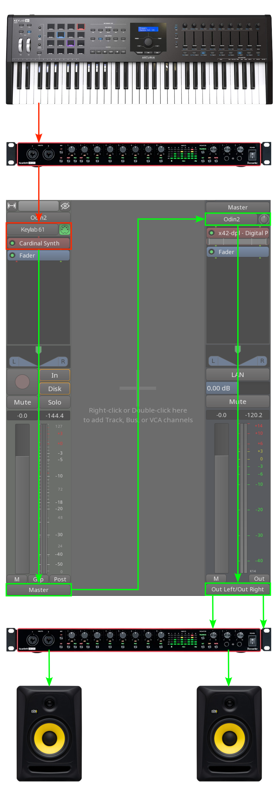

.. _signal_routing:

Signal routing
==============

Routing for audio tracks
------------------------

Ardour exposes multiple ports for various parts of the signal chain to
link those parts: track inputs and outputs, bus inputs and outputs,
sends and inserts, monitor section outputs. When using the JACK audio
backend, these ports are also accessible by other applications and can
be routed externally.

The chart on the right demonstrates a common signal flow for recording
an instrument: a guitar is plugged into a front input of an audio
interface, the signal then goes directly into the track output, passes
the :ref:`processor box <processor_box>` with plugins, fader, and panner,
connects to the input of the master bus, passes its processor box, the
goes into the monitor section, then finally connects to physical outputs
like studio monitors or headphones.

This configuration can have multiple variations, such as:

-  There can be a DI box sitting between the guitar and the front input,
   if the guitar has a passive pickup.
-  The signal from a guitar can pass a DI box and feed into one track,
   but another path can go through preamp/amp/cabinet/mic and feed into
   another track, so that the musician has both processed sound and dry
   sound that can be re-amped later on.
-  The same can be achieved by creating an input I/O plugin (a guitar
   amp/cab simulator), passing a copy of guitar's DI'ed signal through
   it and feeding the I/O plugin's output to another track.
-  Monitoring could be done with hardware, so that there would be no
   monitor section, and thus the master bus would be connected to
   physical output ports directly.

When Ardour creates multiple tracks and/or busses at once, this is what
happens.

-  **Track inputs** are optionally auto-connected to hardware inputs, in
   the round-robin order. In the example below where an audio interface
   only has two inputs and 8 new tracks have been created, Ardour connects
   the first input to the first track, then the second input to the second
   track, then the first input to the third track, and repeats it until all
   tracks have an input assigned for them. The exact configuration will
   depend on how many channels have been chosen for each new track in the
   :ref:`Session > New Session dialog <newopen_session_dialog>`.

   Round-robin assignment of connections

-  **Bus inputs** are left disconnected.
-  The number of **track and bus outputs** are equal to the number of
   inputs of the master bus.
-  Track and bus outputs are always auto-connected to the master bus
   inputs.
-  Master bus outputs are connected to hardware outputs if new session
   don't have a monitor section by default (this is set when the user
   runs Ardour for the first time and can be changed on the
   **Monitoring Page** of the **Preferences** dialog).

This configuration is sufficient to do basic tracking and playback of
many sessions without any adjustment by the user. Changing these
connections is generally not necessary and often leads to problems.

However, for many workflows during mixing, more complicated signal
routing is required. Ardour offers many possibilities for connecting
things to fit any particular workflow.

Routing for MIDI tracks
-----------------------

Typical routing for MIDI tracks is very similar to that of audio tracks.

A MIDI keyboard output goes into MIDI IN port of an audio interface,
then MIDI events are transmitted over USB to a MIDI track where they are
sent to a software synthesizer. The synthesizer plugin outputs two or
more audio channels that are automatically connected to the master bus,
and master bus outputs are connected to studio monitors or headphones.

Notably, the processor box for MIDI tracks and busses always has a MIDI
THROUGH port that carries a copy of all events coming through MIDI IN.

There are also some variations here possible:

-  The first plugin in the track can be a MIDI plugin that somehow
   transforms incoming events, e.g. transposes them by two octaves or
   builds arpeggios and *then* send the resulting notes to a software
   synthesizer or a sampler.
-  The MIDI output from the audio interface can be connected to a MIDI
   bus with an arpeggiator that sends resulted MIDI events to a MIDI
   track for capturing and to a hardware synthesizer for playback.
-  The MIDI keyboard can be also connected directly to a laptop or a
   desktop via a USB port.

Ardour uses the same round-robin logic to connect MIDI ports to MIDI
tracks when multiple MIDI tracks are created. However, when no MIDI
device is connected, Ardour will connect the newest created track to its
own internal virtual MIDI keyboard and keep the other MIDI tracks not
connected.
