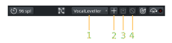

.. _managing_plugin_presets:

Managing plugin presets
=======================

All plugin control widgets, whether they are created by Ardour or by the
plugin, have a common set of controls at the top of the window. These
include four controls for managing plugin presets.

   The plugin presets toolbar

What is a plugin preset?
------------------------

A preset for a plugin is simply a saved set of values for all of a
plugin's parameters. If you load a preset, you are restoring all the
parameters of that plugin to the values stored in the preset. This is an
easy, fast way to manage your preferred settings for particular plugins.

The preset selector
-------------------

The **preset selector** (1) is a regular selector that can be clicked to
display a list of all known presets for this plugin. This will include
presets that have been created by the user, and for some plugin formats,
presets that come with the plugin itself.

Loading a new preset
--------------------

Clicking on the preset selector pops up a menu showing the names of all
available presets. Clicking on the name of a preset loads it, and
various controls in the plugin editor change to reflect the new value of
some or all parameters.

Creating a preset
-----------------

Saving the current plugin settings as a new preset is done by clicking
on the **Add** button (2) at the top of the window. A dialog will appear
asking for a name for the preset.

Saving a preset
---------------

To modify the settings in an existing preset, the preset selector must
be used to load the preset, then, when the settings have been adjusted,
the **Save** button (3) clicked. The new values will be stored, overwriting
the previous version of this preset.

Deleting a preset
-----------------

Deleting an existing preset is achieved by loading the preset first,
then clicking the **Delete** button (4). The preset will be removed, and the
preset selector turns blank, showing that no preset is currently loaded
(although the settings will stay as they were).
