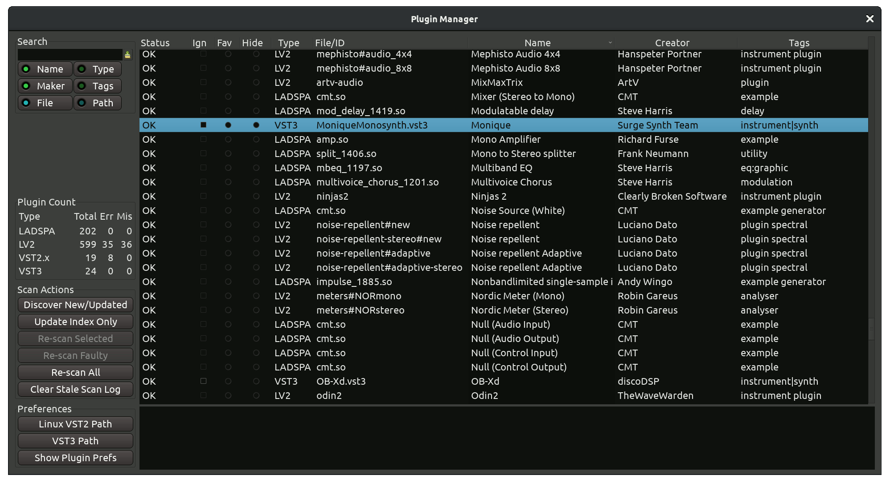

.. _plugin_manager:

Plugin manager
==============

The **Plugin Manager** provides a convenient interface to various
operations on plugins and is the primary troubleshooting tool when
something goes wrong with plugins. It works on both plugin files and the
plugins index.

   The Plugin Manager window

What is a plugins index?
------------------------

For each type of a plugin (e.g. VST3 or AU) there are pre-configured
paths where these plugins are located. Every time Ardour runs, it
re-scans plugins in these paths and recreates an index — a kind of
inventory of available plugins. Whenever you open the :ref:`Plugin
Selector <plugin_selector>` dialog, Ardour reads the list of
available plugins from that index and displays them for you to pick.

Re-scanning paths is important because it's common for plugins to change
on the disk (e.g. when you installed a newer version) or get removed
(when you don't need a plugin anymore). Sometimes plugins get corrupted
due to a hardware failure. Indexing them often helps identifying issues
early on, and the **Plugin Manager** helps reviewing the general state of
affairs with plugins.

Ardour also treats LV2 plugins slightly differently and scans them on
startup unconditionally. You can disable the scanning of VST2, VST3, and
AU plugins entirely in the **Preferences** dialog.

Plugins info
------------

The main part of the **Plugin Manager** window is the table where all
plugins known to Ardour are listed. You can use it to both view
information about a plugin and control some of its aspects:

Status
   Ardour will displays the status of every plug-in file. See below for
   more information

Ign
   Do not load this plugin file at all

Fav
   Set or unset the **Favorite** status for a plugin

Hide
   Load this plugin file, but do not show it in the **Plugin Selector**

Type
   The name of the API this plugin has been built with: VST2, VST3, AU,
   LADSPA, LV2

File/ID
   Displays the file name for LADSPA, VST2, and VST3, as well as the ID
   for LV2 and AU

Name
   User-visible name of the plugin

Creator
   Developer of team of developers who created the plugin

Tags
   Metadata that classifies the plugin by type, e.g. 'instrument|synth'
   or 'analyzer'

The **Status** field specifically has the following options:

OK
   The plugin file has loaded without any issues and the information in
   the cache about it is up to date

New
   The plugin file has just been discovered and successfully loaded for
   the first time

Updated
   The plugin file changed on the disk, the plugin cache has been
   updated accordingly, the plugin file loaded successfully

Concealed
   A VST2 plugin will be hidden from Plugin Selector, if a corresponding
   VST3 plugin exists. The same applies to LV1 (LADSPA) and LV2

Error
   There was a problem loading the plugin file

Stale
   A plugin changed on the disk but hasn't been re-scanned by Ardour yet

Incompatible
   Scan the plugin failed. Typical reasons are 32/64-bit mismatch,
   attempt to load a ``.dll`` on Linux or a ``.dylib`` on Windows

The **Plugin Count** section in the sidebar provides basic information
on available plugins: how many plugins of every supported type are
available through Ardour in total, how many failed to load, and how many
are missing.

Searching
---------

You can search for a specific plugin or a group of plugins. Simply place
the cursor inside the input text box in the upper left corner and type.
Ardour will search in the index

By default, Ardour will search through plugin names, makers, and file
names. Additionally, you can search through **Type**, **Tags**, and
**Paths**.

Scan actions
------------

This section of the sidebar contains commands that operate on the
plugins index.

Discover New/Updated
   This will run a full scan on all known paths to plugin of all
   supported types

Update Index Only
   This will check which plugins were updated without scanning them

Re-scan Selected
   This will re-scan plugin files selected in the main part of the
   window

Re-scan Faulty
   This will only re-scan plugins that previously failed to load

Re-scan All
   This will re-scan all currently known plugins

Clear Staled Scan Log
   This will remove all entries from the index on plugins that changed
   on the disk but haven't been re-scanned

Preferences
-----------

This section of the sidebar allows settings paths to VST2 and VST3
plugins, as well as quickly open the **Preferences** dialog on the
**Plugins** page where you can set various options for scanning plugins
and controlling their default behavior.
