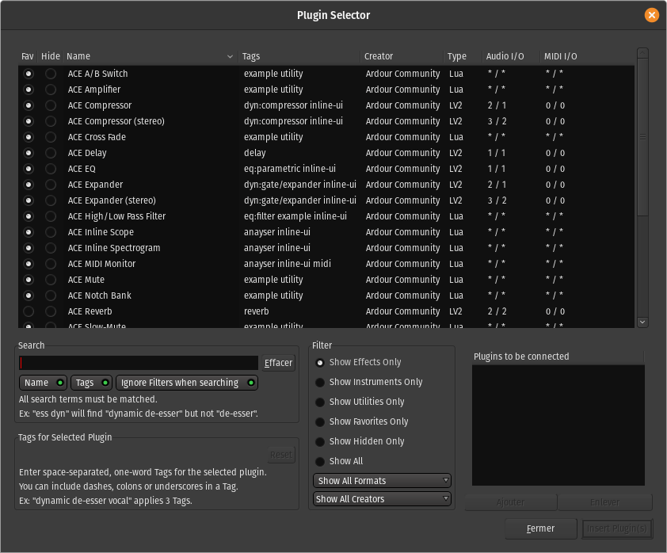

.. _plugin_selector:

Plugin selector
===============

The **Plugin Selector** serves two purposes. Primarily it is used to
control the display status of plugins. It can also be used to find and
insert plugins into the :ref:`processor box <processor_box>`. It is
displayed either by a double-click in the processor box or by choosing
**New Plugin > Plugin Selector…** from the processor box's context menu.

Displayed for each plugin is the status (favorite, hidden), name, tags,
creator (author), type, and the number of audio and MIDI connections.
The plugins can be sorted by clicking on a column header.

   The Plugin Selector window

Plugin display status
---------------------

Clicking on a **Fav**\(orite) or **Hide** radio button changes a plugin's
display status. Clicking on an already selected radio button will cancel
it, returning the plugin to the normal display status. Plugins marked as
a favorite show up in the processor box context menu under **New Plugin
> Favorites** and in the :ref:`Favorite Plugins window
<favorite_plugins_window>`. Setting the hide radio button on a plugin
will keep the plugin from showing in the processor box context menus
**New Plugin > By Creator** or **New Plugin > By Category**.

Filtering listed plugins
------------------------

The bottom left part of the **Plugin Selector** is used to filter the listed
plugins.

The center **Filter** column allows to show only some of the plugins, based
on what they are, their properties, format, creator…

Moreover, direct text search are available in the the Search text-field
on the bottom left. Only the plugins that match *all* the search terms
(space separated) will show up in the upper list.

This textual search can be matched against **Name** and/or **Tags** by checking
the relevant momentary buttons under the search field. Ignore filters
when searching displays all the matching plugins, regardless of the
active filters.

Tags
----

Tags are text labels that can be used to mark a plugin. They are totally
free in their content, allowing the user to mark a plugin with whatever
info is relevant to him, but cannot include spaces (as spaces are used
to separate tags) or special characters except dashes, colons and
underscores.

Adding or removing tags is as simple as editing the **Tags for Selected
Plugin** field while the targeted plugin is selected.

Ardour comes with a large selection of tags for provided or usual
plugins, that are used by default but can be modified at will. It is
possible to go back to this "standard" tagging for a plugin by clicking
the **Reset** button.

Inserting plugins in the processor box
--------------------------------------

The bottom-right part of the Plugin Selector **Plugins to be connected**
shows plugins that have been selected for insertion into the processor
box. A plugin can be added by either double clicking the plugin entry in
the top part, or, if already selected in top left part, by clicking the
**Add** button.

Plugins can be removed from the right part with a double click, or, if
already selected, by clicking **Remove**.
