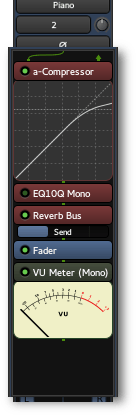

.. _processor_box:

Processor box
=============

In Ardour terminology, a processor is anything which treats the signal
in some way and gets plugged into a mixer strip. Ardour provides several
builtin processors such as the fader or panners. Processors can also be
plugins used for effects or as instruments, as well as sends or inserts
which affect :ref:`signal routing <signal_routing>`.

The arrangement of processors is arbitrary, and there is no limit to how
many there can be. The processor box will automagically add a scrollbar
to itself if there are more processors in it than can be shown in the
given space.

The main box in the top half of a mixer strip shows the **processor
box**. Processors are shown as colored rectangles, with a small LED
beside them that lights up when the processor is enabled. The color of
the processor depends on its location in the sequence; processors that
are **pre-fader** are colored in red, and **post-fader** processors are
colored green (in the default theme).

The **processor box** will always contain a blue **fader** processor.
This indicates where in the processor chain the main channel fader is
located; this is the fader shown in the lower half of the strip. It can
be enabled and disabled like any other processor.

Adding processors
-----------------

Processors can be added to the chain by right-clicking in the processor
list, This does three things:

-  A gap is opened up to indicate the location of the click. The gap
   shows where any new processors will be inserted.
-  The processor under the click is selected.
-  An options menu is presented.

From the menu, new processors can be inserted.

Processors can also be dragged and dropped from the :ref:`Favorite
Plugins window <favorite_plugins_window>` to an appropriate spot in the
Processor Box.

.. note::
   The **Favorite Plugins** window can be populated via the :ref:`Plugin
   Selector <plugin_selector>`, or by dragging and dropping an existing
   processor from the **processor box** to the **Favorite Plugins**
   window.

Reordering processors
---------------------

Processors can be re-ordered using drag and drop. Dragging a processor
allows it to be moved around within the chain, or copied to another
processor list on another track or bus.

Enabling/disabling processors
-----------------------------

To the left of the name of each processor is a small LED symbol; if this
is lit-up, the processor is active.

.. figure:: images/processor.png
   :alt: a typical processor

   A typical processor.

Left-clicking on the LED symbol, or middle-clicking anywhere on the
processor will deactivate the processor and effectively bypass it. Click
again to reactivate the processor.

.. note::
   Some processors have their own bypass controls that are independent
   of the one that Ardour provides; this can make it appear that the
   plugin is non-responsive when its independent bypass control is
   active.

Selecting processors
--------------------

A processor in the **processor box** can be selected with a left-click
on it; it will be highlighted in red. Other processors can be selected
at the same time by left-clicking on them while holding down the
:kbd:`Ctrl` key, and ranges can be selected by left-clicking on them
while holding down the :kbd:`Shift` key.

Renaming processors
-------------------

Context-click on the processor to be removed and select **Rename**. In the
newly opened dialog set a new name and click **Rename**. The caption of
the processor will be instantly changed in the mixer strip.

To restore the original name which, for plugins, is typically the
plugin's name, open the same dialog and click the button to the right of
the text input box, then click **Rename**.

Removing processors
-------------------

Context-click on the processor to be removed, and select **Delete**; or
:kbd:`Shift`-right-click on it; or left-click on it and press the
:kbd:`Delete` key. If multiple processors are selected, they will all be
deleted at the same time.
