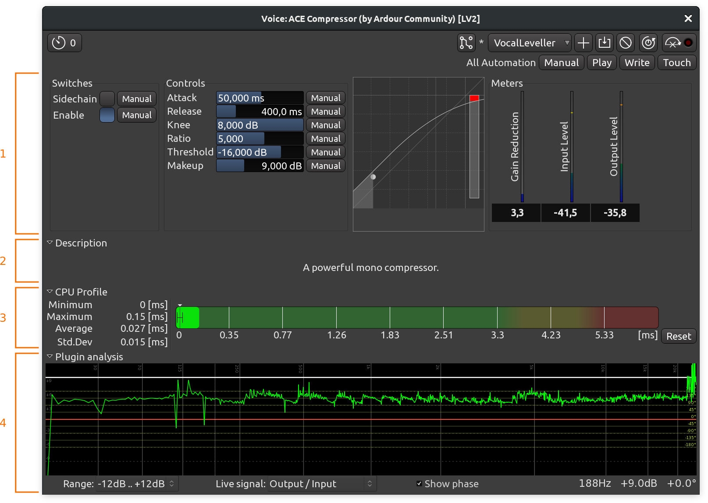
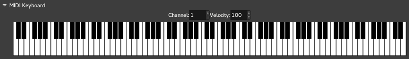

.. _working_with_ardour_built_plugin_editors:

Working with Ardour-built plugin editor
=======================================

The plugin editor can be shown by double-clicking on the plugin within
the :ref:`processor box <processor_box>`. A new window will appear
showing the editor/GUI for the plugin.

   A generic plugin editor (ACE Compressor)

#. Generic plugin editor for plugin parameters
#. Description
#. CPU Profile
#. Analysis graph

Generic plugin editor
---------------------

If a plugin does not have its own GUI, Ardour will construct a generic
plugin editor from a small set of common control elements. Ardour will
do this even for plugins that have their own, if **Edit > Preferences >
GUI > Use Plugins' own interface** instead of Ardour's is disabled.

The generic UI can be temporarily switched to by right-clicking on a
processor and selecting **Edit with generic controls**. This is
necessary in order to access the :ref:`plugin automation controls
<automation>`.

In the generic UI, any controller can be reset to its default state by
:kbd:`Shift`-left-clicking on it.

Description
-----------

This is a rarely used section that displays the contents of the
description metadata of a plugin.

CPU Profile
-----------

This section displays CPU time measurements for the currently opened
plugin. For more information, please see the documentation on the
:ref:`Plugin DSP Load <troubleshooting_plugin_dsp_load>` window.

Analysis graph
--------------

At the bottom of the generic plugin editor, clicking the arrow displays
the **Analysis Graph**.

This graph displays:

-  the transfer function in white,
-  the phase response in red (optional),
-  the post effect spectrum in green.

The **transfer function** plots the output amplitude of the plugin
(considered as a "black box") against its input amplitude, along the
audio spectrum.

The **phase response**, that can be switched on or off using the **Show
phase** checkbox, plots the phase of the plugins output against its
input phase, along the audio spectrum. The scale is shown in yellow on
the right.

The green spectrum plots the **output signal spectrum**, after the
plugin (for tracks that have a signal on).

The **dB scale** selector in the bottom left allows to change the
vertical scale of the graphs.

MIDI instruments specificities
------------------------------

The generic UI provides, for all MIDI instruments plugins, a keyboard,
that can be used either with the mouse, or by using a QWERTY keyboard as
a piano. Both the channel and the velocity can be set above the
keyboard.

   The MIDI keyboard in instruments plugins
