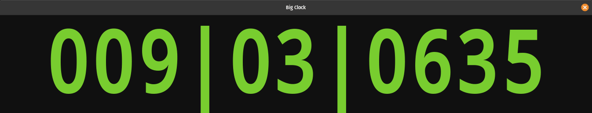
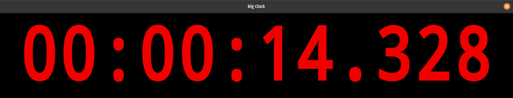

.. _big_clock:

Big Clock
=========

The **Big Clock** is a copy of the main :ref:`primary transport clock <transport_clocks>`, in its own window, and is activated by checking **Window > Big Clock**.

   The Big Clock, in Bars:Beats mode

The window is always on top of other windows (Ardour or others), fully resizable and the clock will always fill the window, making it very useful when working away from the screen but still wanting to see the playhead position clearly (such as when working with a remote control device across a room), or when showing the time on its own screen.

Like most other clocks, it can be right-clicked to change its :ref:`clock mode <editing_clocks_clock_modes>`. It can also be :ref:`edited <editing_clocks>` to transport the playhead to a specific point in time. The big clock will also change its visual appearance to indicate when active recording is taking place, by changing color.

   The Big Clock, in Minutes:Seconds mode, while recording
