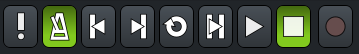
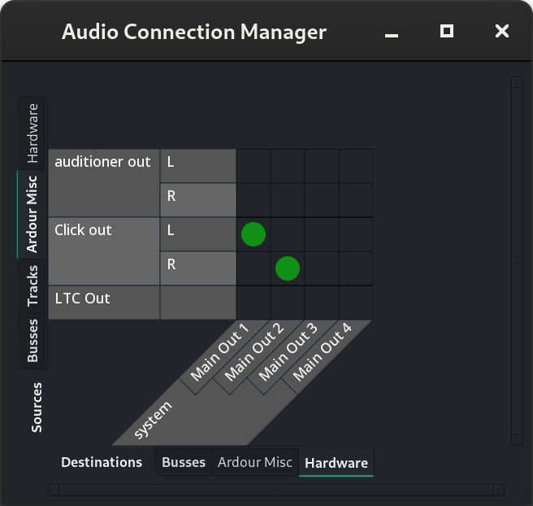

.. _metronome:

Metronome
=========

The metronome helps performing in correct tempo and time signature when recording. Musicians hear the metronome clicking with an optional emphasis on the first beat.

The button switching the metronome on and off is located to the left from the transport panel:

.. _launching-and-stopping:

Launching and stopping the metronome
------------------------------------

There are several ways to toggle the metronome:

-  Clicking the button to the left of the transport panel.
-  Pressing the **`** keyboard shortcut.
-  Pressing either the designated button or any other button on a MIDI keyboard that is mapped to the metronome in a :ref:`MIDI map <using_control_surfaces_generic_midi_midi_binding_maps>`.

.. _setting-up:

Setting up the metronome
------------------------

Right-click the metronome icon in the toolbar to open the **Preferences** dialog on the **Metronome** page. The page has several options:

-  **Emphasis on the first beat**: when enabled, the metronome will make a louder click on the first beat to help musicians with the time signature.
-  **Use built-in default sounds**: when this option is disabled, you can load your preferred audio files for the metronome. Otherwise, Ardour will use built-in audio files.
-  **Gain level**: you can set here how loud you want metronome clicks to be. You can also adjust this setting by hovering the metronome toggle button in the main window and scrolling the mouse wheel up or down. As you change the value, the tooltip will update to show the new gain level.
-  **Enable metronome only while recording**: when enabled, you will only hear metronome clicks while recording; there will be no metronome clicks while playing back the takes.

.. _routing-metronome:

Routing metronome clicks
------------------------

The metronome has separate outputs in Ardour, so you can route that signal in the **Audio Connections** dialog (**Window > Audio Connections**) however you like, e.g. to a :ref:`foldback bus <foldback_strip>` for each performer in the studio or on stage.

The **Click Out** port with **L** and **R** channels is located on the **Ardour Misc** tab on the left:

By default, the metronome omits the master bus entirely and connects directly to the first pair of hardware outputs in the output device you selected. This way the clicks don't get processed in the master bus and don't show up in the exported mix.
