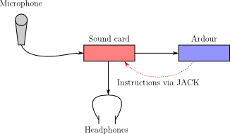
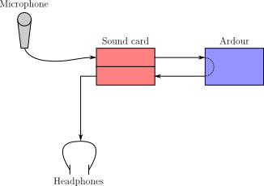

.. _monitor_signal_flow:

Monitor signal flow
===================

There are three basic ways to approach monitoring:

External Monitoring
~~~~~~~~~~~~~~~~~~~

.. figure:: images/external-monitoring.png
   :alt: External monitoring
   :class: right-float

When using **external monitoring**, Ardour plays no role in monitoring at all. Perhaps the recording set-up has an external mixer which can be used to set up monitor mixes, or perhaps the sound-card being used has a "listen to the input" feature. This approach yields zero or near-zero latency. On the other hand it requires external hardware, and the monitoring settings are less flexible and not saved with the session.

Audio driver Hardware Monitoring
~~~~~~~~~~~~~~~~~~~~~~~~~~~~~~~~

Some sound cards have the ability to mix signals from their inputs to their outputs with very low or even zero latency, a feature called **hardware monitoring**. Furthermore, on some cards this function can be controlled by Ardour. This is a nice arrangement, if the sound card supports it, as it combines the convenience of having the monitoring controlled by Ardour with the low latency operation of doing it externally.

Software Monitoring
~~~~~~~~~~~~~~~~~~~

With the **software monitoring** approach, all monitoring is performed by Ardour—it makes track inputs available at track outputs, governed by various controls. This approach will almost always have more routing flexibility than JACK-based monitoring. The disadvantage is that there will be some latency between the input and the output, which depends for the most part on the buffer size that is being used.
