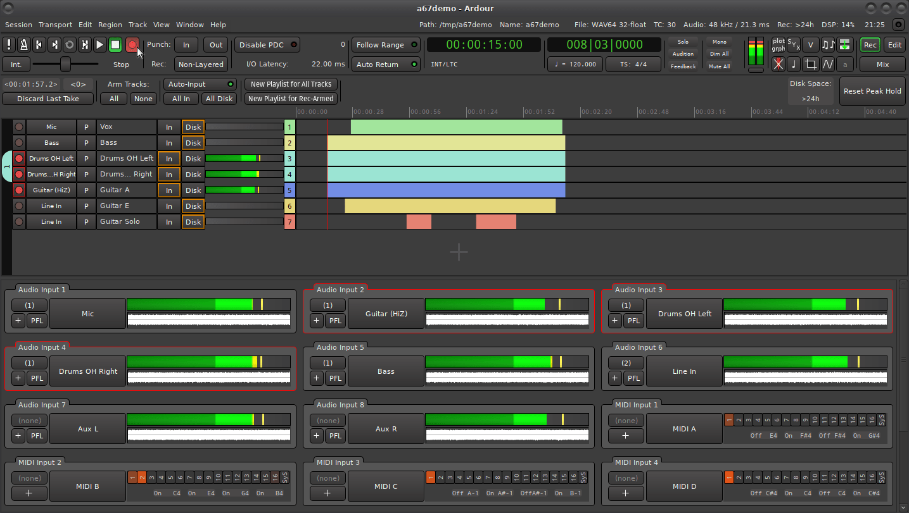
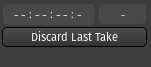
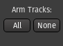
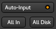
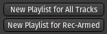
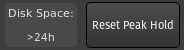
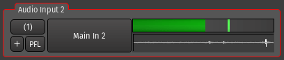

.. _recorder:

Recorder
========

Although all the process of recording an audio or MIDI performance can be done in any mode, the Recorder provides a synoptic view of most parameters and actions related to capturing this performance, hence giving more confidence in the final result.

   The Recorder window. *(*\ `full-size
   image </images/record_window.png>`__\ *)*

.. note::
   The Recorder is another view on settings, parameters, and actions that can be set or called in other modes. Any change done in the Recorder is instantly reflected in e.g. the Editor, and vice versa.

The Recorder, being a mode, sports the same :ref:`main menu <main-menu>`, :ref:`status bar <status-bar>`, and :ref:`toolbar <transport-bar>` as the Editor and Mixer. It adds a secondary toolbar, a simplified session view, reminiscent of the Editor, and a global input panel.

The Secondary Toolbar
---------------------

The subsections below describe the secondary toolbar from left to right.

.. _recorder_last_take_manager:

Last Take Manager
~~~~~~~~~~~~~~~~~

This manager displays information about the last (or current) take :

-  A **duration display**, that shows the duration of the last (or current) recording. It is always displayed as ``hours:minutes:seconds:tenths``, regardless of the :ref:`Transport
   clocks <transport_clocks>` display settings.
-  An **x-run counter**, an x-run being a buffer under(or over)flow. Each time such an x-run occurs, an artifact is recording, that can be audible or not, but is a red flag for the recording quality.
-  A **Discard Last Take** button, that deletes the last finished recording(s), effectively removing the audio file(s) from the hard drive, hence destructive.

This last button cannot be used while recording, the transport must be stopped. It also has no concept of history, and repeatedly clicking it wont discard previous takes from last to first, in order to prevent destroying good takes. Lastly, it does not reset the playhead position, as the **Transport > Stop and Forget Capture** menu would.

.. _recorder_global_arm:

Global Arm
~~~~~~~~~~

Like the *Monitor Options* below, these buttons apply to all the tracks at once.

It is a convenient shortcut to arm (All)/disarm (None) all the tracks for recording.

.. _recorder_monitoring_options:

Monitoring Options
~~~~~~~~~~~~~~~~~~

These buttons allow switching the monitoring mode globally, for all the tracks at once. The monitoring mode allows to decide what the user wants to be listening to, between:

-  **All In**: all the tracks play what is on their *In*\ puts,
-  **All Disk**: all the tracks play the actual content of the playlist on *Disk*,
-  or both: also called "cue monitoring" if both buttons are engaged, a combination of the two modes above, where all the tracks play existing data from disk while also listening to the input signal. This is particularly useful for MIDI tracks, where one can hear a performance/new material while listening to the playback of existing material in the track.

The **Auto Input** switch allows Ardour to auto-select what is played, which is:

-  When not playing: all tracks are on *In* (to listen to any connected source)
-  When playing, all tracks are on *Disk* (to play whatever was recorded on those tracks)
-  When recording, on rec-enabled tracks: *In* and on non rec-enabled ones: *Disk*

If **Auto Input** is disabled, then you will hear the Input being monitored whenever a track is armed, even if you aren't actually recording. If **Auto Input** is enabled, then you will hear playback when the transport is rolling, and the tracks will only switch to Input when the master-record arm is engaged (so you are actually recording).

.. _recorder_new_playlist:

'New Playlist' buttons
~~~~~~~~~~~~~~~~~~~~~~

Recording multiple takes can easily be done in Ardour by using :ref:`playlists <understanding_playlists>`, as a track can have multiple playlists and it is easy to :ref:`switch <playlist_operations>` from one to another.

The two buttons create new, "blank", playlists to record on:

-  **New Playlist for All Tracks** creates a new playlist for each visible track, while
-  **New Playlist for Rec-Armed** uses the ● recording status of each track to generate new playlists.

Creating new playlists is both cheap in terms of CPU and memory, and easy to revert by changing the track's playlist back to its previous one. Playlists on different tracks can also share the same name, allowing for a better workflow when recording: Ardour suggests *Take.\ #n* as the name for each playlist, so that they stay somewhat correlated.

.. _recorder_disk_space:

Disk space and Reset Peaks
~~~~~~~~~~~~~~~~~~~~~~~~~~

-  *Disk space* shows how many time or recoding is available on the current hard drive (i.e. the hard drive where the session is located), by accounting the bit depth, sampling rate, and number of armed tracks. The result is either a duration, or ``>24h`` if it exceeds 24 hours.
-  *Reset Peak Hold* clears the memory of the highest recording level in the meters located in the bottom input panel, and displayed with a green line.

.. _recorder_tracks:

Tracks
------

The Simplified Session View is a view of the session, specifically tailored for the purpose of recording, that is similar to the Editor (or the :ref:`Summary 
`) with notable differences, among which:

-  it always encompasses the whole session in the time axis,
-  the regions are displayed as blocks, not waveforms,
-  no editing, like moving or resizing regions, is possible
-  each track (or lane) has a fixed and narrow height

All those differences are consequences of the aim of this view, which is to keep thing not too busy and clear in a recording context. The most important settings related to the recording process are easily available and to facilitate the work of the operator.

.. _recorder_simplified_session:

Simplified session view
~~~~~~~~~~~~~~~~~~~~~~~

Here is how a track looks in the Recorder window:

Each lane is made of (from left to right):

-  A **zone** showing :ref:`grouping <track_and_bus_groups>`, as in the Editor, with the same functions and menus.
-  A **●** rec-arm button. When armed, the entire button will turn pink, and change to bright red as soon as the transport is rolling and the track is recording. Right-clicking will allow to en/disable *Rec-safe*, protecting the track against accidental recording.
-  An **Input** button displaying the connected input(s) of the track. It is the same button as the *Input* button shown in the :ref:`Mixer strip <audiomidi_mixer_strips>`, and behaves exactly the same way (Left-clicking to show the input menu, Right-clicking shows the input
   connection matrix).
-  A **P** playlist button displaying the connected input(s) of the track. Again, it is the same button as the one shown in the :ref:`Editor's track header <audio_track_controls>`, and behaves exactly the same way (Left-clicking to show the playlist menu).
-  A **Track Name** label, displaying the track's name. Double-clicking allows to edit (rename) the track.
-  Two **In** and **Disk** buttons allowing to set this particular track's monitoring option, as described above.
-  **\*N\*** level meters showing the input level of the track, as in the :ref:`Editor's track header <audio_track_controls>`, *N* being the number of input channels of the track.
-  A **n** numbered button, using the :ref:`track's color <track_color>` as background color. Numbering can be useful when using OSC, a MIDI controller, or when recording multiple performances at once.
-  An **overview** of the track's content, with solid blocks representing regions. The region's color is the track color, except while recording where the recorded regions are displayed in red.

Like in the Editor or Mixer, a :ref:`new track, bus or VCA <adding_tracks_busses_and_vcas>` can be created by either double or right-clicking on an empty place in the track list.

.. _recorder_global_input_channel:

The Global Input Panel
~~~~~~~~~~~~~~~~~~~~~~

This panel lists all the audio and MIDI system inputs. The inputs are displayed either vertically or horizontally based on the :ref:`Preferences <preferences_appearance_recorder>`.

If an input is used by a track that is armed for recording, it sports a red frame.

The controls on each input are:

-  a **(1)** button indicating how many tracks are fed by this input. Clicking this button will show only those tracks.
-  a **+** button, allowing to create a track that will be automatically connected to this input. The type of track (MIDI or aurio) depends on the input type.
-  a **PFL** button, or *Pre-Fader Listen*, active only if Use monitor section in this session is checked in the :ref:`Session Properties <session_properties_properties_monitoring>`. When active, sends the soloed signal to the :ref:`Monitor <monitor_section>`.
-  a **Input's Name** button. Inputs can be named or renamed at will, to ease the recognition of e.g. one microphone in a multi-track recording, like a multi-instrumentalist performance, by clicking the button. Ardour stores this name for the device, so any later session using this input will show this label.

The right hand side of the input depends on the kind of input, either
audio or MIDI. For an audio track:

-  a live level-meter for this input that shows the current level of the audio signal. A green line marks the *Peak Hold*, i.e. the maximum level reached on this input.
-  a continuous waveform, showing the input state during the last 5 seconds.

For an MIDI track:

-  a channel indicator, the channel numbers lighting up as events come in to show channel activity.
-  a MIDI monitor, showing the last four MIDI events.
