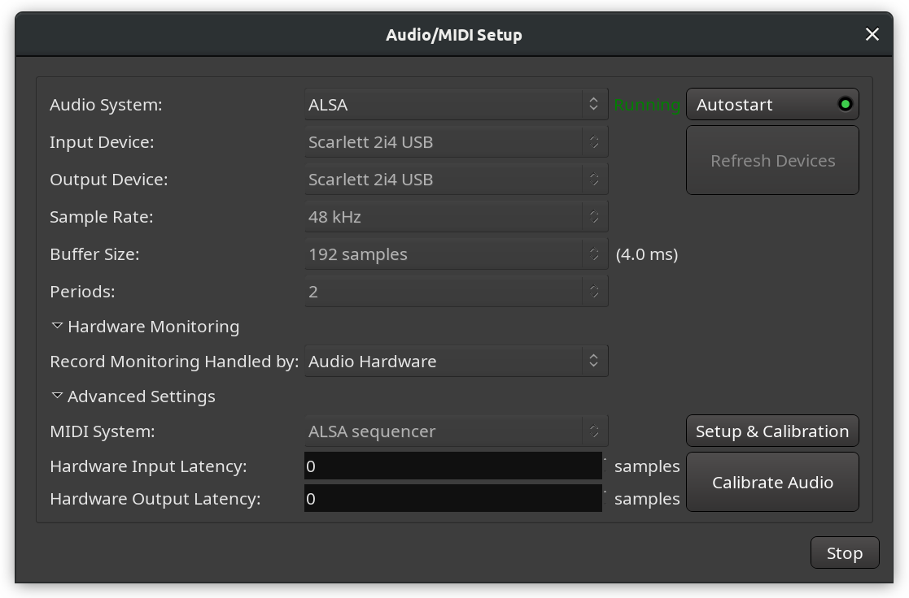

.. _audio_midi_setup:

Audio/MIDI setup
================

This window exposes the different audio options to be used by Ardour for
the current work session and for hardware and software.

   
   The Audio/MIDI Setup dialog

Here are the available settings:

Audio System  
   Depending on the operating system, Ardour can possibly use different audio systems, e.g. on Linux, both ALSA, PulseAudio, and JACK are available. On Mac OS X this will typically be CoreAudio. Advanced users on all platforms may also use NetJack which provides network audio I/O.

Input Device  
   The selector should show all available interfaces provided by the audio system above and which are capable of capturing audio.

Output Device  
   The selector should show all available interfaces provided by the audio system above and which are capable of playing audio.

Sample Rate  
   The selector will allow to select from any sample rate supported by the device selected above it.

Buffer Size  
   The size of the buffer used by the audio interface can be adjusted to allow for either lower latency, or lower CPU usage and higher latency.

Periods  
   Number of frames between each hardware interrupt (analog-digital or digital-analog conversion).

Hardware Monitoring  
   This section allows choosing whether Ardour or audio hardware should be handling recording monitoring.

Advanced Settings  
   This section contains several lower-level settings listed below.

MIDI System  
   This allows choosing a MIDI driver. On macOS, this will be CoreMIDI. On Linux, the choice will be between ALSA sequencer and ALSA raw devices. Choosing **None** will disable the connection to the external MIDI backend and prevent Ardour from being exposed to external MIDI ports while allowing to route MIDI events inside the program.

Setup & Calibration  
   This button runs a semi-automated guided process to obtain precise hardware latency measurements for available MIDI ports.

Hardware Input/Output Latency  
   Specify the hardware delay in samples for precise latency compensation.

Calibrate Audio  
   This button runs a semi-automated guided process to obtain precise hardware latency measurements for available audio ports.
