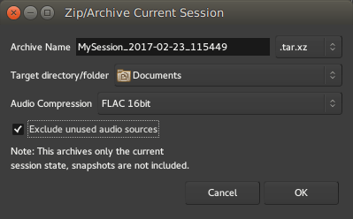

.. _backup_and_sharing_of_sessions:

Backup and sharing of sessions
==============================

An Ardour session is stored in a single folder on the computer's filesystem. This makes backup very easy: any tool capable of backing up a folder can be used to backup a session. The location of a session is picked when it is created—by default it will be in the default session location, which can be altered via **Edit > Preferences > General > Session**.

The single folder approach also makes sharing a project easy. Simply copy the session folder (onto a storage device, or across a network) and another Ardour user (on any platform) will be able to use it.

There is one complication in both cases: a session may reference media files that are stored outside of the session folder, if the user has opted not to select **Session > Import > Copy to Session during import**. Backing up a session with embedded files will not create a copy of the session containing those files. To bring those external files to the session folder, the :ref:`Session > Clean-up > Bring all media into session folder menu <cleaning_up_sessions>` can be used.

Using the dedicated Zip/Archive Current Session tool
----------------------------------------------------

The Zip/Archive Current Session tool is located in the **File > Archive…** menu.

It allows to create a single file containing everything useful in the session, to share it or back it up, conveniently compressed to a session-archive which is a zip-file (``tar.xz`` to be specific) containing all the audio, MIDI, plugin-settings,… and the currently active session. Ardour can also extract those bundles (**Session > Open…**).

As opposed to zipping the entire session-folder manually,

#. the session-archive only contains the current session-snapshot and only files which are used
#. externally referenced files are included in the archive.

The window shows the following options:

Archive Name
   The name of the archive file, defaulting to the name of the session followed by the date and time

A dropdown extension selector
   Allows to choose between different kind or compressed archive file types

Target directory/folder
   Defines where in the filesystem the archive file will be generated

Audio Compression
   A dropdown menu allowing to compress the audio files themselves by using an audio-tailored compression format, more on  below

Exclude unused audio sources
   A checkbox to drop every audio that is in the session, but not actually used in the editor

The **Audio Compression** selection accepts any of:

-  None
-  FLAC 16bit
-  FLAC 24bit

Encoding the audio sources to FLAC allows for a good size reduction of the session. It should be noted though that FLAC is a fixed-point format, meaning that if the audio in the session is in a floating-point format, this conversion will lose some information on the samples values that are rounded, though usually, this lost information cannot be perceived. Choosing **None** for **Audio Compression** does not compress the audio to FLAC, hence preserving the floating-point data at the cost of a bigger file size. Notice also that converting to FLAC automatically normalizes the audio.

Using the **Exclude unused audio sources** option allows to only keep the files actually used in the session, which can be useful to leave any unused take or reference material out of the backup, reducing the archive's global file size.
