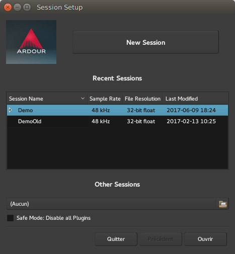
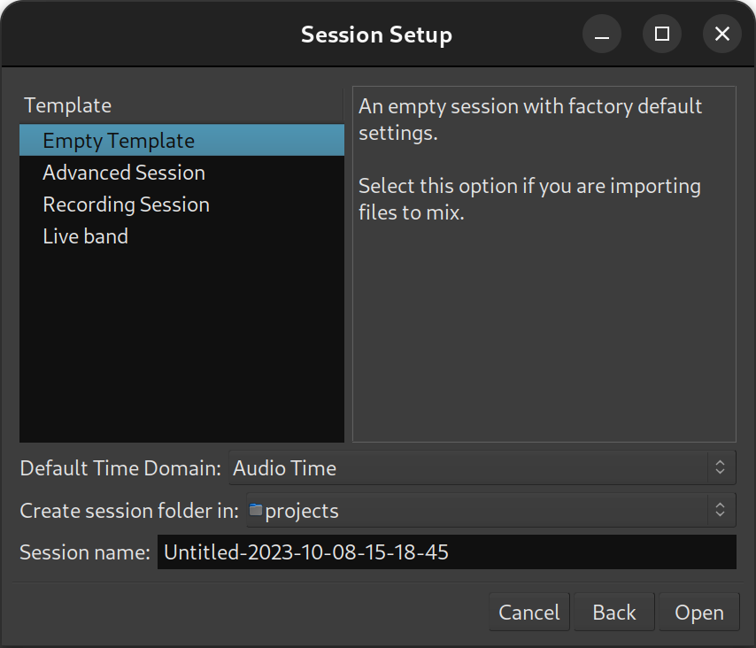
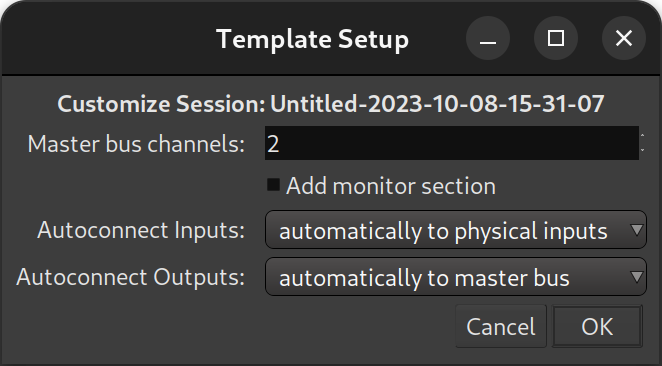

.. _newopen_session_dialog:

New/Open Session dialog
=======================

The initial session dialog, displayed at each start of Ardour, consists of several consecutive pages:

Recent page
-----------

On this page, an existing session can be opened. Any :ref:`snapshot <snapshots>` of a particular session can also be accessed by clicking on the arrow next to the session name to display all snapshots, and then selecting one.

If the session is not displayed in the **Recent Sessions** list, the **Other Sessions** button will bring up a file selection dialog to navigate the file system.

Alternatively, a new session can be created.

Open page
---------

.. figure:: images/open-session-page.png
   :alt: The Session Setup dialog
   :width: 50%

This page allows to open an arbitrary session from the disk.

Available options are:

-  Regular Ardour sessions
-  Ardour session archives
-  Sessions in the Advanced Authoring Format (AAF)

New page
----------------

This page allows to type in the name of a session, select a folder to save it in, and optionally use an existing :ref:`template <session-templates>`. The different templates, both the "factory" ones and the ones created by the user, are easily available on the left-side panel.

Depending on the chosen template, a specific **Template Setup** window may be shown, allowing the user to fine-tune the details of the template and/or choose between the different options of the template.

Templates can be huge time savers when working on similar projects, or on usual projects, as they allow to preset and tweak a lot of the :ref:`session properties <session_properties>`, (like the availability of a :ref:`monitoring section <monitor_section>`, connection to a Master Bus, etc.), and handle the creation of :ref:`tracks <adding_tracks_busses_and_vcas>` of any kind.

The **Empty Template** preset allows to create a session from scratch. Everything a session template does can be done manually—albeit more tediously—and the resulting sessions will not differ whatsoever.

The factory templates are:

Empty Template
   Creates an empty session with no tracks and no monitoring. A stereo Master Bus is created, and any track created defaults to output on this bus. 

Advanced Session
   Like the **Empty Template**, but adds the ability to easily manage the Master bus (channels, hardware connection, and track autoconnection), and the creation of a monitoring section.

Recording Session
   Like the **Empty Template**, but allows the fast creation of a number of tracks, optionally ready to record.

Live Band
   Fast tracks the creation of usual tracks for a band setup (vocals, guitars, piano, ...), and optionally adds usual effects on these tracks.

Selecting a template will display its description in the right-side panel, while hovering over a template name will show a tooltip indicating if it is a factory template, or, if it is a user-created one, which version of Ardour was used to create it.

Whether or not a template is used, and before the **Template Setup** dialog, the :ref:`Audio/MIDI Setup <audio-midi-setup>` will be shown.

The **New Session** dialog also allows selecting session's time domain—either audio time or beat (musical) time. This defines the defaut selection of visible timeline rulers and units in which various markers operate in.
