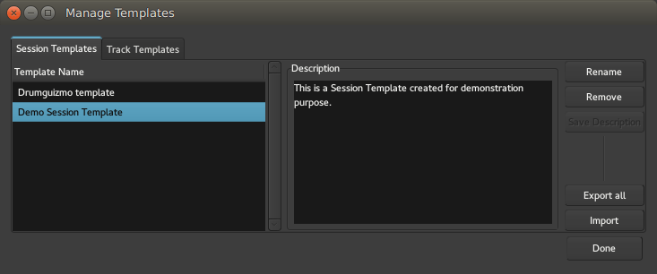

.. _session_templates:

Session templates
=================

Session templates are a way to store the setup of a session for future use. They do not store any *audio* data but can store:

-  The number of tracks and busses, along with their names
-  The plugins present on each track or bus (if any)
-  All I/O connections

Creating a session template
---------------------------

The **Session > Save Template** shows a dialog asking for the name of the
new template, and a description.

Using a session template
------------------------

In the :ref:`New Session dialog <newopen_session_dialog>`, a panel lists
the different template (factory and user-created).

Managing templates
------------------

To manage templates, choose **Window > Templates**. To access this menu item, you have to have a session open.

   The Manage Templates window

Both session templates and track templates can be managed through the **Manage Templates** window, which can perform the following actions:

-  Renaming a template
-  Removing one
-  Adding/modifying its description
-  Exporting the templates (e.g. to be used in another Ardour instance)
-  Importing templates (from e.g. another Ardour instance).

See also :ref:`Adding Tracks and Busses <adding_tracks_busses_and_vcas>` for information on templates for individual tracks or busses.
