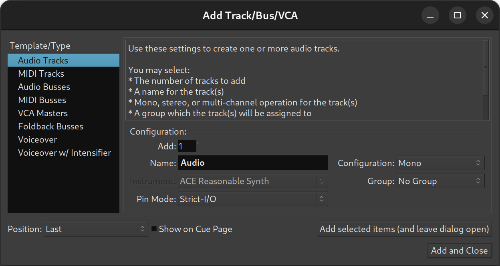

.. _adding_tracks_busses_and_vcas:

Adding tracks, busses and VCAs
==============================

A track, bus or VCA can be added to a session by either:

-  Choosing **Track > Add Track, Bus or VCA…**
-  Right-clicking in an empty part of the track controls area
-  Clicking the Plus (**+**) button underneath the list of tracks in the mixer

Any of these actions will open the **Add Track/Bus/VCA dialog**.

   
   Add Track/Bus/VCA dialog

The list of available track templates (both factory and user-created ones) in the left panel allows for choosing the :ref:`track's type <track-types>` (e.g. Audio, MIDI, bus, VCA, etc.). Some templates can do even more, like the factory-provided **Live Band** that automatically creates a typical number of tracks for a common band setup. See :ref:`New Session <newopen_session_dialog>` for more information about templates.

Any template can be fine-tuned using the controls in the dialog:

Add  
   Selects the number of tracks, busses or VCAs to create.

Name  
   Defines the name of the new track. If multiple tracks are to be created, or if a track with the same name already exists, a space and number will be appended to the end (e.g.: Audio 1, Audio 2…).

Configuration  
   This menu allows choosing from a number of routing templates, which determines the number of input ports and optionally contains plugins and other mixer strip configurations. The most common choices here are **Mono** and **Stereo**. When the **Custom** option is selected, upon clicking **Add**, Ardour will ask for the number of channels to initiate a new audio track, bus, or foldback bus with.

Instrument  
   This option is only available for MIDI tracks and busses and allows the selection of a default instrument from the list of available plugins.

Group  
   Tracks and busses can be assigned to groups so that a selected range of operations are applied to all members of the group at the same time (selecting record enable, or editing, for example). This option assigns the new track/bus to an existing group, or creates a new group.

Pin Mode  
   Defines how the number of output responds to adding a plugin with a different number of outputs than the track itself. In **Strict I/O** mode, plugins cannot alter the track's channel count, while in **Flexible I/O** mode, it will automatically adapt to the I/O of its plugins. See :ref:`Signal flow <trackbus_signal_flow>` for details.

Position  
   Defines where in the track list is the track created. The default is *Last*, i.e. after all the tracks and busses, and can also be *First*, *Before Selection* (to place it just above the selected track) or *After selection*.

Multiple tracks of different types can be created by using the **Add selected items (and leave dialog open)** button, which, when used in conjunction with the **Add** field, allows for a very fast and efficient way to create an initial track setup.

New tracks appear in both the editor and mixer windows. The editor window shows the timeline, with any recorded data, and the mixer shows just the processor elements of the track (its plugins, fader, etc).

Removing tracks and busses
--------------------------

**Removing** tracks and busses is done by selecting them, right-clicking, and choosing **Remove** from the menu. A warning dialog will ask for confirmation as track removal cannot be undone; this option should be used with care!
