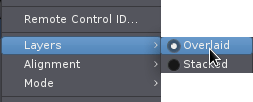

.. _track_layering:

Track layering
==============

Ardour allows arbitrary **layering** of regions—there can any number of regions at a given position. By default, the regions are **overlaid** in the editor window, to save vertical space.

However, this display mode can be confusing for tracks with many overdubs, because its not obvious in which order the overdubs are layered. Although there are other methods of moving particular regions to the top of an overlapping set, and although Ardour also has playlists to manage :ref:`takes <playlist-usecases>` a bit more efficiently than just continually layering, there are times when being able to clearly see all regions in a track without any overlaps is reassuring and useful.

The example below shows a track with a rather drastic overdub situation, viewed in normal **overlaid mode**:

.. figure:: images/overlaps_layered.png
   :alt: Overlapping regions in overlaid mode

   Overlapping regions in *overlaid* mode

This display can be changed by right-clicking on the track header, showing the menu displayed above. There are two choices for layers, and **Overlaid** is currently selected. Clicking on **Stacked**, the track display changes to:

   Overlapping regions in *stacked* mode

Regions can still be moved around as usual, and can be dragged so that they overlay each other again, but when the mouse button is released, things will flip back to them all being stacked cleanly. The number of **lanes** for the track is determined by the maximum number of regions existing in any one spot throughout the track, so if a track has 10 overdubs stacked up in one spot, it will end up with 10 lanes. Obviously, using a large track height works much better for this than a small one.
