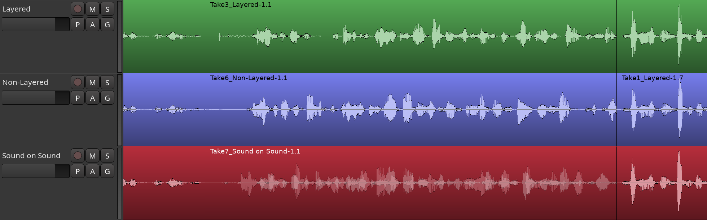
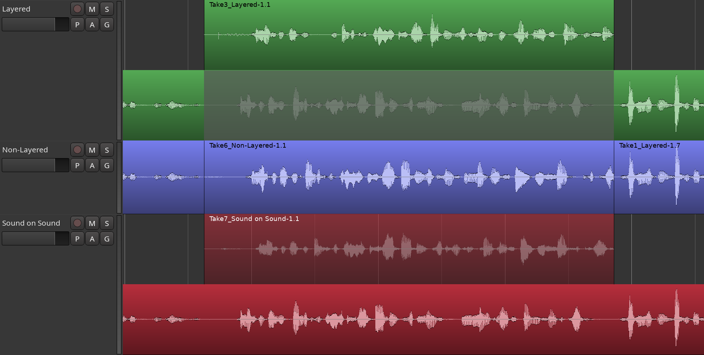
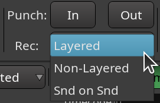

.. _track_modes:

Track modes
===========

Audio tracks in Ardour have a mode which affects how they behave when
recording:

Layered  
   Tracks in **layered** mode will record non-destructively—new data is written to new files, and when overdubbing, new regions will be layered on top of existing ones. This is the recommended mode for most workflows. When recording with the layered mode, Ardour only does input monitoring.

Non-Layered  
   Tracks using **non-layered** mode will record non-destructively—new data is written to new files, but when overdubbing, the existing regions are trimmed so that there are no overlaps. This does not affect the previously recorded audio data, and trimmed regions can be expanded again at will. Non-layered mode can be very useful for spoken word material, especially in combination with :ref:`push/pull trimming <pushpull_trimming>`. When recording with the **non-layered** mode, Ardour only does input monitoring.

Sound on Sound  
   Tracks using **Sound on Sound** mode will record non-destructively—new data is written to new files, but when overdubbing, new regions will be layered on top of existing ones in non-opaque mode which means both existing and new material will be played back after the recording is over. This is convenient for a variety of use cases, such as adding MIDI Control Change events on top of recorded live performance. When recording in the **Sound on Sound** mode, Ardour does cue monitoring.

Results of recording in layered and non-layered modes are visually the same. However, with the sound-on-sound mode lower layers are visible under upper layers, because in that case new regions with overdubs are created with disabled **Opaque** setting.

   Layered, non-layered, and sound-on-sound modes in overlaid view

To illustrate the difference, here is the screenshot of the same tracks, but this time — in **Stacked** track mode (rather than **Overlaid** as on the screenshot above).

   Layered, non-layered, and sound-on-sound modes in stacked view

The overdub is an opaque region on top of the original content for the *Layered* mode. For the **Non-Layered** mode, it completely replaces the matching part of the original content. And for the **Sound on Sound** mode, it's a transparent region on top of the original content.

The switch between layered, non-layered, and sound-on-sound modes is a global setting available in the main toolbar right below the buttons enabling Punch In and Punch Out.

   
   Layering switch
