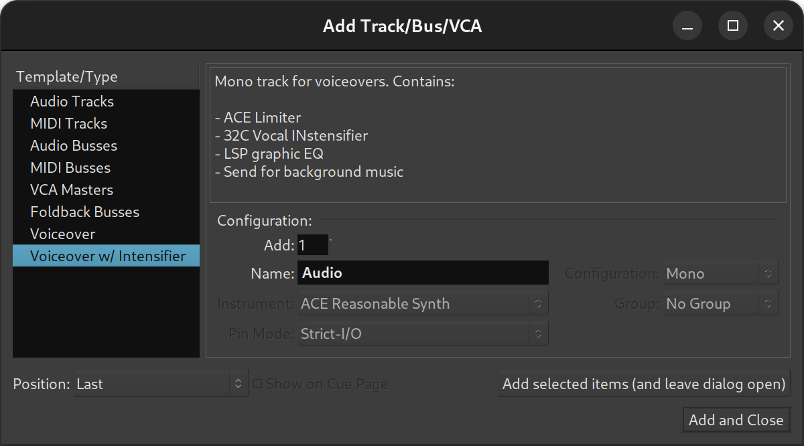
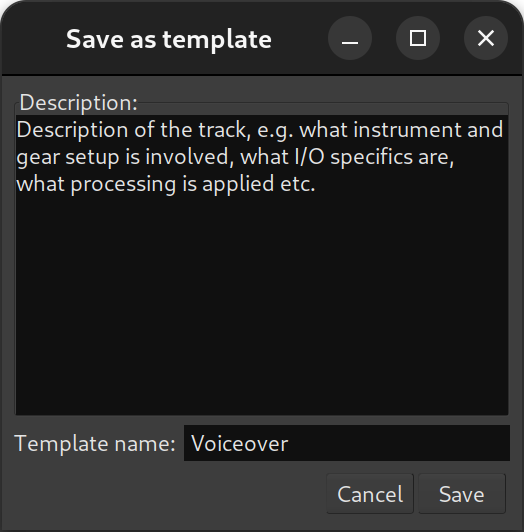
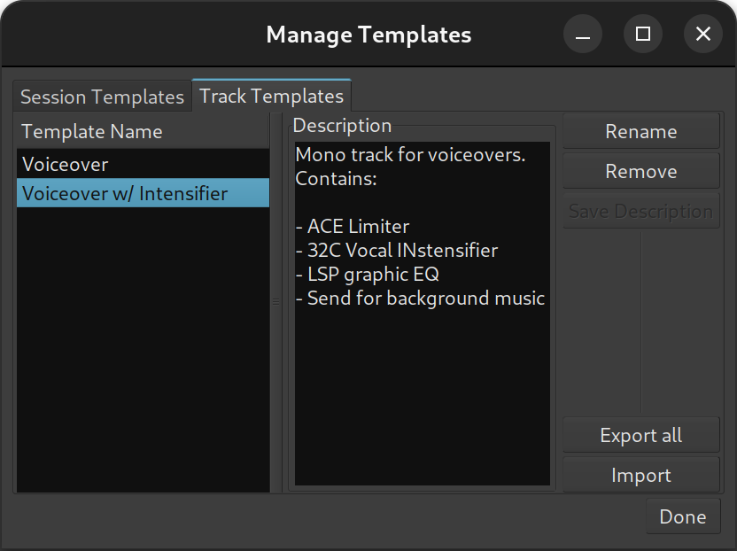

.. _track_templates:

Track templates
===============

Track templates simplify recording of new material by reusing tried and true I/O and processing settings. They are listed in the **Add Track/Bus/VCA** dialog below regular options such as audio and tracks, busses, and VCAs.

   
   Selecting a track template

Each track templates stores the entire state of a track it was created from:

-  I/O configuration including sends and inserts
-  State of mixer controls (mute, solo, solo iso/lock etc.)
-  All the processors and their settings

Creating track templates
------------------------

To create a new track template, right-click the name of the track in its mixer channel and select **Save Track Template…**.

In the newly opened dialog, add a description for the template, then give it a name that will be displayed in the **Add Track/Bus/VCA** dialog, click **Save**.

A slightly verbose description of a template will be helpful when there are multiple similar templates available.

Managing track templates
------------------------

Track templates are managed in the same dialog as session templates.

   
   Track templates management

You can rename existing templates to help differentiate between similar options, change the description, or remove an existing template.

Additionally, you can export all track templates to an archive for sharing, or import track templates from an archive that someone shared with you.
