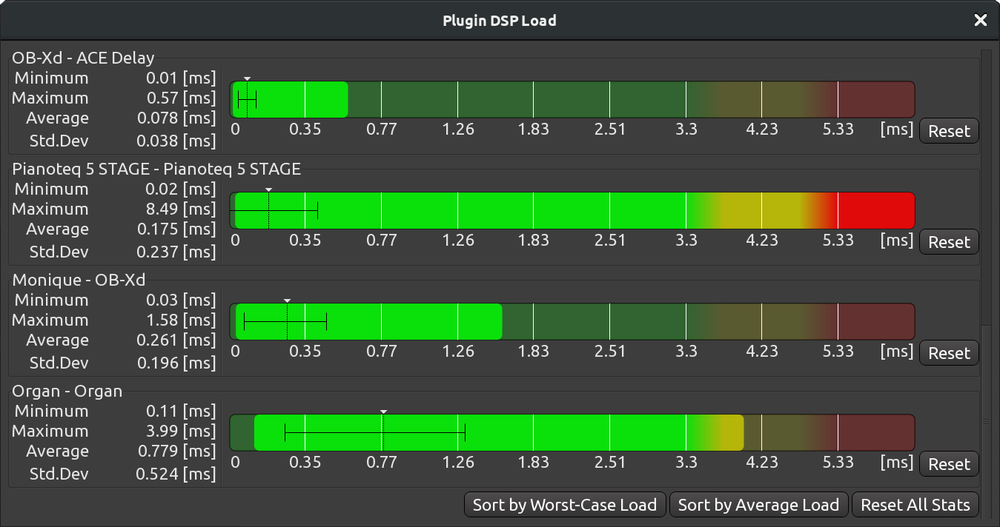
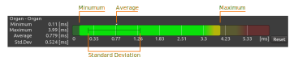

.. _plugin_dsp_load:

Plugin DSP Load
===============

The **Plugin DSP Load** window is helpful in cases where some of the
plugins need too much CPU time to process buffers, resulting in audible
clicks and pops in the output, but you aren't quire sure which ones are
causing this exactly or you do know, but you need actual stats.

   The Plugin DSP Load window

For each plugin in use, there is a chart and numeric data that
represents minimum, maximum, and average CPU time used, as well as
standard deviation. This, along with simple color coding — green for
safe amount of CPU time, red for too much CPU time required — gives you
a good overview of what's going on in the session.

   Plugin DSP Load chart legend

The **Plugin DSP Load** window has basic sorting options: by worst-case
load or by average load. This helps easily locating the worst offenders.
You can also click to reset all stats.

You can use the data provided by the **Plugin DSP Load** window to
decide whether you want to replace a plugin with a less resource-hungry
one, freeze a track, or report a potential bug to the plugin's developer
and wait for an update.

It's worth noting that certain type of plugins, like convolution reverbs
and guitar amp simulators, tend to consume more resources.
