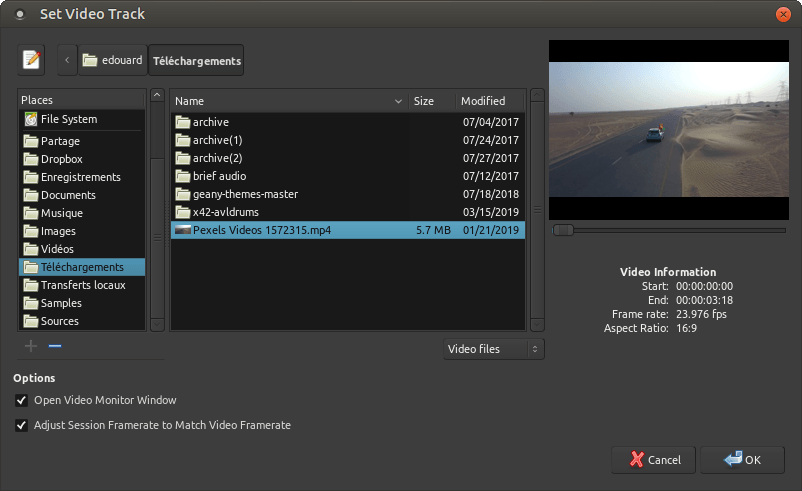

.. _workflow_and_operations:

Workflow and operations
=======================

Overview of Operations
----------------------

Session > Open Video…
   Add/replace a video to/on the timeline

Window > Video Monitor
   Open/close external video monitor window

View > Video Monitor > …
   Various settings of the video monitor

Session > Export > Export to Video File…
   Export session and multiplex with video-file

Left-drag the video in the timeline
   Re-align video and move 'locked' audio-regions along

Context-menu on the video-timeline: Lock
   Prevent accidental drags

Audio region context menu: *Name_Of_The_Region* > Position > Lock to video
   Mark audio region(s) to be moved along with the video.

Adding a video
--------------

Adding a video is a two-step process: selecting a video file, and
choosing import mode and optionally selecting an audio track to extract.
Only one video can be present in the session, so opening a video when
one is already opened results in replacing the video.

Launching the video server (optional)
~~~~~~~~~~~~~~~~~~~~~~~~~~~~~~~~~~~~~

.. figure:: images/launch_video_server.png
   :alt: The Launch Video Server dialog

   The Launch Video Server dialog

Importing a video makes Ardour start the video server automatically. If
the Show video Server Startup Dialog option in the Video section of the
:ref:`preferences <preferences_video>` is checked, the Launch Video
Server window is shown, allowing more complex operations, e.g.
connecting to a remote video server instead of a local one.

Selecting a file
~~~~~~~~~~~~~~~~

   The video open dialog

This step is rather straight-forward. The panel on the right side allows
to seek through the video and displays basic file information. It is
also useful to check if the video format/codec is supported.

The lower part of the window shows some options:

-  **Open Video Monitor Window** to automatically show the video monitor
   (Harvid). This can also be done later by using the **Window > Video
   Monitor** menu which is binded to :kbd:`Alt-V` by default.
-  **Adjust Session Framerate to Match Video Framerate** which can also
   be set later with the :ref:`Session Properties <session_properties>`.
   Having the session and video framerate at the same value allows their
   sync not to drift off.

.. _video_import:

Import options
~~~~~~~~~~~~~~

   The Transcode/Import Video dialog

This step analyzes the video file in more detail and offers import
options:

Import/Transcode Video to Session
   This is the default. The video will be imported in a suitable video
   format/codec for the timeline and video monitor and saved inside the
   session folder. A location other than the session folder can also be
   chosen (external disk, or network storage of the video server on a
   different machine) by using the **Output File:** field.

Reference from Current Location (Previously Transcoded Files Only)
   Only useful for opening files that were previously encoded (are
   already in a good format/codec for Ardour). Should be used with
   care.

Do not Import Video (Audio Import Only)
   Useful for extracting audio only.

By default the video is imported using the original width/height. If it
is a large video (e.g. Full HD), it makes sense to scale it down to
decrease the CPU load and disk I/O required to decode and play the file.

A small, low-quality representation of the image is usually sufficient
for editing soundtracks. The default bitrate in kbit/sec is set to use
0.7 bits per pixel (in comparison, the average DVD medium uses 5000
kbit/s; at PAL resolution this is about 0.5 bits per pixel, but the DVD
is using the **mpeg2**—a denser compression algorithm than the **mjpeg**
codec used by Ardour).

The Extract Audio: offers options regarding the Audio part of the
stream, allowing to either not extract audio, or to choose which audio
stream to add to the session.

When extracting any audio, if it includes :ref:`LTC timecodes
<timecode_generators_and_slaves>`, those can be extracted and used to
sync the video by checking the option below.

Working with A/V
----------------

Working with A/V in Ardour is similar to working in a pure audio setup,
except for the presence of a video timeline in the :ref:`ruler <ruler>`
zone, and a Xjadeo video window, showing a preview of the result.

.. figure:: images/video_timeline.png
   :alt: The Video Timeline

   The Video Timeline

The Xjadeo window supports some user interactions, such as showing some
OSD information or changing the zoom level. Xjadeo's documentation is
available on its
`website <http://xjadeo.sourceforge.net/xjadeo.html#heading8>`__.

.. _video_export:

Exporting Video
---------------

   The Video Export Dialog

The video export will take audio from the current Ardour session and
multiplex it with a video file. The soundtrack of the video is taken
from an audio export of Ardour's master bus.

An arbitrary video file can be chosen. For high quality exports, the
original file (before it was imported into the timeline) should be used.
This is the default behaviour if that file can be found. If not, Ardour
will fall back to the imported proxy-video which is currently in use on
the timeline. Any existing audio tracks on this video file are stripped.

The range selection allows to cut or extend the video. If the session is
longer than the video duration, black frames are prefixed or appended to
the video. (Note: this process may fail with non-standard pixel aspect
ratios). If Ardour's session range is shorter, the video will be cut
accordingly.

Audio sample rate and normalization are options for Ardour's audio
exporter. The remaining settings are options that are directly passed on
to ffmpeg.

The file format is determined by the extension chosen for it (.avi,
.mov, .flv, .ogv, .webm,…). Note: not all combinations of format, codec,
and settings produce files which are according to specifications. For
example, flv files require sample rates of 22.1 kHz or 44.1 kHz, mpeg
containers can not be used with AC-3 audio codec, etc. If in doubt, one
of the built-in presets should be used.

Ardour's video exporter is not recommended for mastering! While ffmpeg
(which is used by Ardour) can produce high-quality files, this export
lacks the possibility to tweak many settings. We recommend using
`winff <http://www.biggmatt.com/winff/>`__,
`devede <http://www.rastersoft.com/programas/devede.html>`__ or
`dvdauthor <http://dvdauthor.sourceforge.net/>`__ to mux and master.
Nevertheless this video exporter comes in handy to do quick snapshots,
intermediates, dailies or online videos.
